# Pool of Radiance 繁體中文 Remake

本專案以 SSI《Pool of Radiance》DOS 版為主要行為 oracle，建立可跨平台、
可從開場玩到結局的繁體中文 remake。目前只用鍵盤就能從標題完成建角／建隊、
進入 Phlan、走完開場導覽、觸發遭遇、打完戰術戰鬥並讓劇情接著跑下去；
遊戲內的敘述文字全部是繁體中文。

腳本層已經接完：原版 ECL 的 61 條 opcode 在八個封存檔的 29 個 block 裡
**沒有一條走不過去**（`cmd/pool-ecl-frontier` 可重生盤點）。

以「完整繁中、正常主線可破關、三平台可發行」為分母，目前保守工程估計為
**55～65%**。三個分母各自的狀態：

| 分母 | 狀態 |
|---|---|
| 完整繁中 | 遊戲內文字 1,731 句 100%；UI 逐畫面補上中，字型缺字 0 |
| 正常主線可破關 | 腳本層無阻塞；敵方 AI 已換成原版的接近規則，**戰鬥數值仍與原版有差**，未做全程實跑 |
| 三平台可發行 | 發行包可重生；Linux 實測啟動，Windows／macOS 真機驗收未做 |

估算依玩家垂直鏈與交付硬門檻，不是用規格文件數量換算；
細節與未知項以 [CONTEXT.md](CONTEXT.md) 與 [WORKLIST.md](WORKLIST.md) 為準。

## 現況

- 遊戲畫面的繁中已鋪到每一個現有畫面：標題、人物管理、建角四個選單、
  人物資料頁與姓名輸入、裝備、商店、神殿、戰利品、戰術戰鬥、遭遇與交涉選單。用詞一律取自軟體世界代理當年的官方中文說明書
  （種族、性別、四種職業、九個陣營、六項屬性），不是重新翻譯。字型用倚天
  16x15 點陣字，屬第三方資產、不進 repo，執行時以 `-eten-font` 指定；
  `-lang zh` 沒有字型會失敗即關閉，不會默默用英文跑。截圖見
  `docs/screenshots/pool-remake-chinese-*.png`。
- 遊戲內的敘述文字**全部翻完**。原版的 ECL 文字盤點下來共 **1,731 句、
  110,473 個字元**（`docs/audit/dos-ecl-text-inventory.json`），那就是遊戲內文字的
  翻譯總量，現在覆蓋率是 **1,731 句（100%）／110,473 字元（100%）**：八個 ECL
  封存檔的敘述、對話、選單選項與怪物名一句不漏。譯文以原文整句為鍵放在
  `internal/gametext`，原版檔案一個位元組都不改。覆蓋率由
  `cmd/pool-text-inventory -coverage` 量出來，譯文表出現盤點檔沒有的原文時失敗即關閉；
  另有測試拿盤點檔逐條核對每個原文都真的存在。用詞以軟體世界的官方說明書與
  探險者手冊為準，說明書沒收的專名逐條記在 `docs/reference/manual/glossary.md`。
  戰術畫面已中文化。
- **探險者手冊進遊戲了**：說明書上冊的線索報導 58 條、酒店傳言 23 條與議會公告
  18 則共 99 條，由 `cmd/pool-journal-corpus` 從轉錄稿切成
  `internal/journal`，遊戲裡按 `J` 開啟，直接打編號就跳到那一條。畫面說
  「成為線索報導 46」時，玩家不必再去找三十多年前的紙本說明書。
  下冊附錄的規則表（金錢換算、法術表、武器表）還沒接。
- **武器會影響戰鬥了**：物品型別表不在執行檔裡（`DS:54E0h` 那段是未初始化的），
  來源是 ZIP 的 `poolrad/items`。索引由墓園那把 `Two-Handed Sword +1` 正對照
  釘住：它的記錄寫 `+2Eh = 26h`，而表的第 `26h` 筆正是雙手劍的 1d10／3d6。
  力量與敏捷的四張修正表逐分支照抄自 overlay-25。按 `I` 裝上武器之後，
  戰術戰鬥的 THAC0 與傷害骰由武器決定，不再是 placeholder。契約見 spec 065。
- **法術表解出來了**：`START.EXE` 裡有一張 56 筆的法術名稱表（位移 41052，
  步長 41）。名稱之後全是零，所以職業與等級不在表裡；分組由順序推出，
  並與說明書下冊第六章逐條核對——六個分組的界線正好落在說明書的 LEVEL 標題上。
  56 條的中譯全部取自軟體世界的官方說明書。遊戲裡按 `K` 查閱。契約見 spec 068。
- **法術記得起來也施得出來**：記憶陣列在角色記錄 `+1Fh`，可記憶數依職業等級
  與睿智算（spec 070／072）；選好的法術要紮營休息過才施得出來，戰鬥中按 `C`
  施展，67 格效果裡接得出來的有 62 格（spec 073／074／098）。
  **會不會一條法術由法術書決定**：記錄 `+32h + 編號` 一格一 byte，
  建角時牧師會第 1 級全部神術、法師會寫死的四條，昇級時牧師自動補齊、
  法師多一次可以學新法術的額度（法術一覽按 `L`）。所以一級法師記不起火球術。
  契約見 spec 110。
- **商店可以買東西了**：四家店與墓園戰利品走同一條 ECL 服務邊界，差別在三個
  旗標；存貨就是 `ITEM3.DAX` 的四個 block（武具店 57 件、珠寶店 11 件、
  雜貨店 7 件、銀器店 13 件），價格在記錄的 `+3Ah`，與 AD&D 玩家手冊相同
  （長劍 15、板甲 400、匕首 2、鏈甲 75）。付款扣金幣，買入沿用既有的 16 格與
  力量負重上限。契約見 spec 067。
- **戰術戰鬥打得完了**：擺陣、先攻、移動預算、命中與傷害都照原版的規則走
  （spec 057／059／061／062）。裝備會影響戰鬥：武器決定 THAC0 與傷害骰
  （spec 065），盔甲與負重決定 AC 與腳程（spec 079／080——包含「有加值的
  盔甲壓掉護符戒指」那條，七名預設人物的內部 AC 逐一相符）。實測一隊拿
  長劍 +4、穿板甲 +2 的戰士只用按鍵從標題走到索寇要塞，五個回合清光十二隻
  怪物，戰後腳本接著跑。**敵方 AI 走的是原版的骨架**（spec 096）：先問武器
  搆得到誰，搆得到就打，搆不到才照戰術模式那一列的五個相對方向依序試、
  第一個進得去的就走；追誰會跨回合黏著，要換人才從候選名單裡擲骰隨機挑。
  三處仍是近似並在畫面上標成 `PROVISIONAL AI`：候選名單的來源、五個方向多
  一道「要離目標更近」的閘門，以及全不合用時的繞路備案——後兩者原版沒有，
  它靠跨回合換模式脫困，照抄會讓怪物在死路裡卡上好幾回合。
- **ECL 腳本層接完了**：61 條 opcode 在 29 個 block 裡沒有一條走不過去。
  這一輪補上的包括傷害（`2Eh`）、交涉（`2Ch`）、偷竊（`28h`）、突襲判定
  （`22h`／`23h`）、文字／數字輸入（`10h`／`0Fh`）、隊伍統計（`1Eh`）、
  NPC 加入（`36h`，隊伍因此放得下第七、第八個人）與挑人（`39h`）。
  盤點由 `cmd/pool-ecl-frontier` 重生，「已處理」那一半直接讀共用 VM 的
  switch 與 Pool 的 passthrough 清單，不另抄一份會過期的常數。
- **三平台發行包做出來了**：`tools/package-release.sh <版本>` 產出 Linux
  AppImage、Windows ZIP 與 macOS 雙架構 ZIP（osxcross 交叉編譯，不需要 Mac），
  並寫一份 `manifest.json` 固定雜湊。AppImage 已在容器裡實際啟動並截圖
  （`docs/screenshots/pool-release-linux-appimage.png`）；Windows 與 macOS
  只證明得出「建得出來」，真機驗收還沒做。發行包不含原版資料與倚天字型，
  兩者的權利都不在本專案。契約見 spec 066。
- 已固定 DOS ZIP、歷史中文 RAR 與八張 D64 輸入雜湊。
- 已盤點 DOS ZIP 168 個檔案；包含 `START.EXE`、`GAME.OVR`、八組
  ECL／GEO／WALLDEF／PIC／SPRIT DAX 與角色存檔樣本。
- engine `dax` 已成功解析 113／113 個 DAX、合計 1,245 blocks，Pool 已成為
  該 codec 的第二個真實作品 consumer；payload 語意仍待逐項驗證。
- 已用未修改 DOS 程式建立穩定標題與主選單 oracle；`TITLE.DAX` block 1 經
  typed adapter 匯出、2× 最近鄰呈現後，與原版標題逐像素 AE=`0`。
- ECL payload 映射基準已由原版 loader／resolver 閉合為 `9900h`；`9914h` 是五個
  command-set headers 之後的第一條指令位址。勘誤後 26／29 blocks 可完整走圖、
  14,724 條 reachable instructions 可解；其餘 3 筆仍待分類。正式玩家路徑已使用
  同一 VM session 跨 ECL archive 執行目前需要的 blocks，不能把全 corpus 的三個
  graph 缺口誤寫成「production VM 尚未接」。
- 已有第一支可執行的 Ebitengine `cmd/pool-game`：讀取本機原版 ZIP 的 `TITLE.DAX`，
  可由標題以正常按鍵進入主選單並走完 Race→Gender→Class→Alignment→角色資料頁
  →姓名→原版 HEAD／BODY／KEEP 肖像編輯器→READY／ACTION 戰鬥圖示編輯器；
  F1 Help、F2 theme、ESC 返回、F10 離開與視窗拉伸已接通。戰鬥圖示使用原版
  CHEAD／CBODY，支援 Head、Weapon、Size、六部位雙色及 READY／ACTION 同時預覽。
  完成確認後會寫入版本化 remake 角色庫、回到原版順序的 Party Creation Menu；
  Add、六名玩家角色上限，以及穩定玩家邊界的 schema 6 F10／Load campaign round-trip
  已接通；對話／服務／戰鬥中途續點尚未完成。DOS 285-byte CHA／SPC export
  尚未完成。正常 `B` 已依原版 producer chain 接到 `GEO3/block 0, (15,1), facing 6`
  的 typed geometry 與原版 `WALLDEF3/8X8D3` 第一人稱素材。正常 Begin 隨即依
  ECL3/block 0 進入 Rolf 導覽第一頁：首次旗標、`(15,1), facing 3`、monster 12、
  原版 ZIP packed text 與 Return 閘門已達 exact。Spec 011 另由四張原始 byte table
  閉合並實作完整 34-step scripted tour：六個停靠 selector 顯示七頁原版文字，最後在
  `(0,4), facing 3` 走到 ECL `EXIT`。每步 delay 是可重現的約 150ms approximation；
  導覽結束後已可用方向鍵轉向，並以原始 GEO wall／door data 在 cardinal 朝向前進；
  每格 ECL dispatch 已從 Sune 神殿、City Hall 公告／委託走到跨 archive 的 Slums；
  鎖門互動、全部地圖事件與完整 Pool 移動政策仍未閉合。視錐 traversal 仍是
  跨作品共用引擎的 strong inference。
- 第一場 Slums 遭遇已從真實 ECL 載入 `MON2CHA.DAX` 的 `ORC ×1／ORC ×3`，並將
  ECL PC 停在戰後 continuation 前，不接受 Enter 假造勝利。Spec 048～053 已閉合
  285-byte 怪物戰鬥欄位、基礎命中／傷害、雙攻擊槽、先攻、移動預算、八方向步進與
  66×4 戰術格位表；Spec 056～062 再閉合戰場生成、佔格與朝向弧、直線追蹤與成本、
  目的格探測、反應攻擊閘門與回合迴圈。遭遇畫面按 Enter 即可進入戰術戰鬥：
  回合、先攻、八方向移動、攻擊、傷害、倒地與勝敗都會實際跑，勝利後由停在
  `COMBAT` 邊界的 PC 續跑戰後腳本，戰敗則依 Spec 046 契約 5 不續跑。
  先攻輪到敵方時牠們會自己行動——挑目標用 Spec 056 的鄰近成本表、每一步過
  目的格探測、撞上就攻擊，所以戰鬥是雙向的、也真的會輸。原版的怪物 AI 尚未
  反組譯，「挑哪個目標、走哪一步」是暫定策略；反應攻擊接進移動提交也還沒接上。
  部署位置與隊伍的 AC／THAC0／傷害骰同樣是暫定值（原版陣型樣板是執行期填的、
  不在檔案裡，角色記錄也還沒有那三項），全部標在畫面上。
- 原版建角已走通 portrait 與 OLD／NEW READY／ACTION combat icon；六部位雙色、
  Head、Weapon、Size 的 285-byte CHA offsets 已由 UI 單變因差分閉合。六種族的
  原版職業清單已進 typed catalog，並有 Race→Gender→Class→Alignment＋ESC 狀態機。
- 共用 engine 固定使用同層
  `/home/anr2/cht/golden_box/golden-box-remake-engine`，本 repository 不複製
  engine source。
- 第一支 `cmd/pool-inventory` 只做唯讀 ZIP／DAX 形狀盤點，不解讀劇情語意。

## 從原始碼建置需要什麼

**這個 repository 公開的是原始碼與發行包，不是一份 clone 下來就編得起來的專案。**

`go.mod` 依賴共用引擎 [`golden-box-remake-engine`](https://github.com/wicanr2/golden-box-remake-engine)，
那個 repository 是**私有**的——遊戲專屬的內容在這裡，可重用的引擎另外授權
（見 [LICENSE](LICENSE) 與 [NOTICE.md](NOTICE.md)）。沒有引擎的存取權，
`go build` 會停在抓不到模組那一步。

想玩的人請直接下載[發行版](#下載)，不需要建置。
想讀程式碼、回報問題或提修正建議的人，原始碼在這裡都看得到。
需要建置權限請來信洽談。

## 本機盤點

原版檔案不進 Git。將 `Pool of Radiance (1988).zip` 放在 repository 根目錄後，
以專案 Docker 工具鏈執行：

```sh
tools/go.sh run ./cmd/pool-inventory -zip "Pool of Radiance (1988).zip"
```

目前真相來源與下一步分別見 [CONTEXT.md](CONTEXT.md) 與
[WORKLIST.md](WORKLIST.md)；逐輪變更見 [WORKLOG.md](WORKLOG.md)；輸入盤點收據見
[docs/audit/input-inventory.md](docs/audit/input-inventory.md)。

標題格式與驗收見 [Spec 001](docs/spec/001-dos-title-picture.md)；原版啟動收據見
[DOS 標題／主選單 oracle](docs/playtest/dos-title-main-menu.md)。

## 下載

[**最新發行版**](https://github.com/wicanr2/Pool-of-Radiance-cht/releases/latest)
有 Linux AppImage、Windows ZIP 與 macOS 雙架構 ZIP。

發行包**不含原版遊戲資料，也不含中文字型**——兩者都沒有公開散布權，要自己準備：

| 要準備的 | 怎麼給 |
|---|---|
| 原版遊戲的 ZIP | `-zip <路徑>` |
| 倚天中文系統的 `stdfont.15` | `-eten-font <路徑>` |

沒有指定字型時 `-lang zh` 會直接結束並說明原因，不會默默用英文跑——中文介面
缺字型時畫面會整片空白，那看起來像繪圖壞掉，不像沒有字型。其餘旗標見發行包裡的
`README.md`。

## 目前 remake 畫面

下面十五張全部是**繁體中文介面的實機畫面**，由 `tools/capture-chinese-menu.sh`
在 Docker／Xvfb 裡開真的 Ebitengine 視窗、逐鍵走一次正常玩家路徑拍下來的：
標題 → `ENTER` → `C` 建角 → 命名 → 肖像 → 戰鬥圖示 → 加入隊伍 → `B` 開始冒險
→ 按完羅夫導覽 → 自由移動 → 平面圖 → 手冊 → 裝備 → 法術 → 戰術盤面。
中途任何一步沒有換到預期的畫面，腳本就失敗即關閉，不會拍出一張看起來對的圖。
來源提交、日期、雜湊與字型狀態見
[繁中截圖 manifest](docs/audit/remake-chinese-screenshot-manifest.json)。

字型是倚天 16×15 點陣字，屬第三方資產、不進 repo，執行時以 `-eten-font` 指定。

### 建角

| 人物管理選擇項 | 種族 |
|---|---|
| 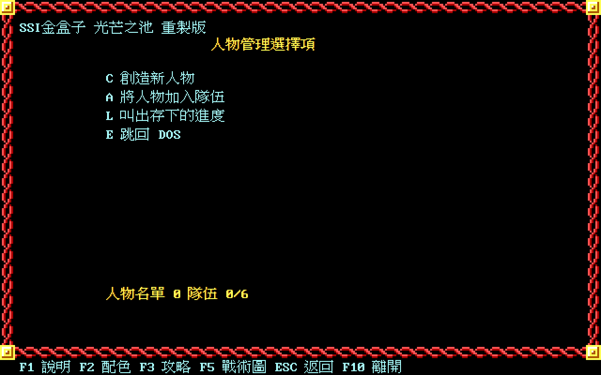 | 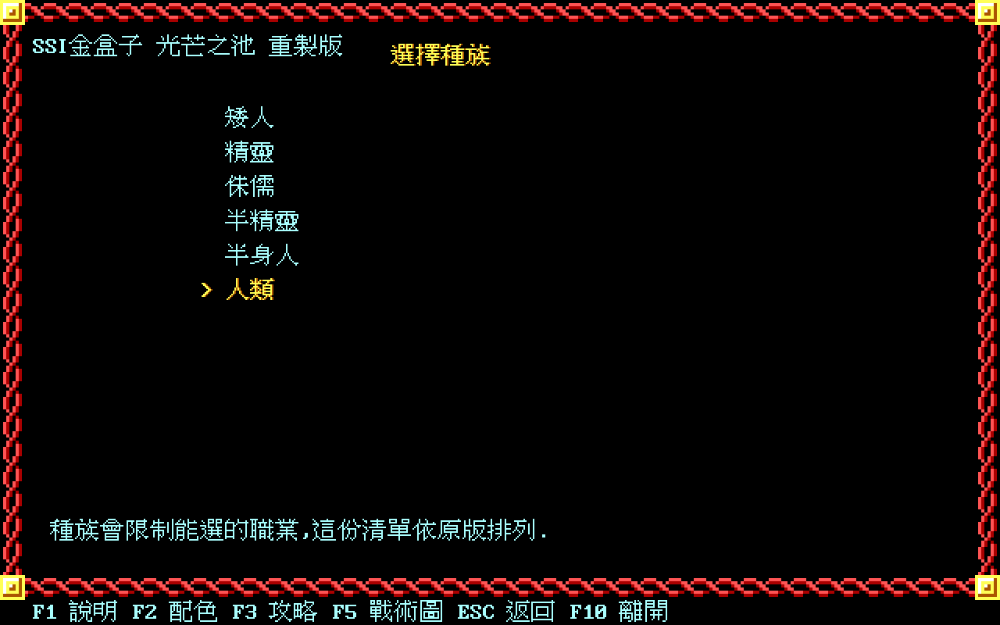 |

| 職業 | 人物資料頁 |
|---|---|
| 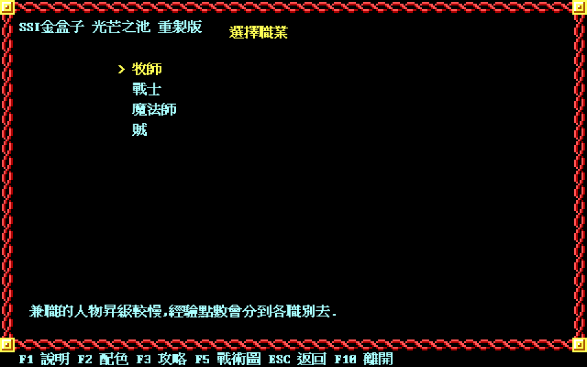 | 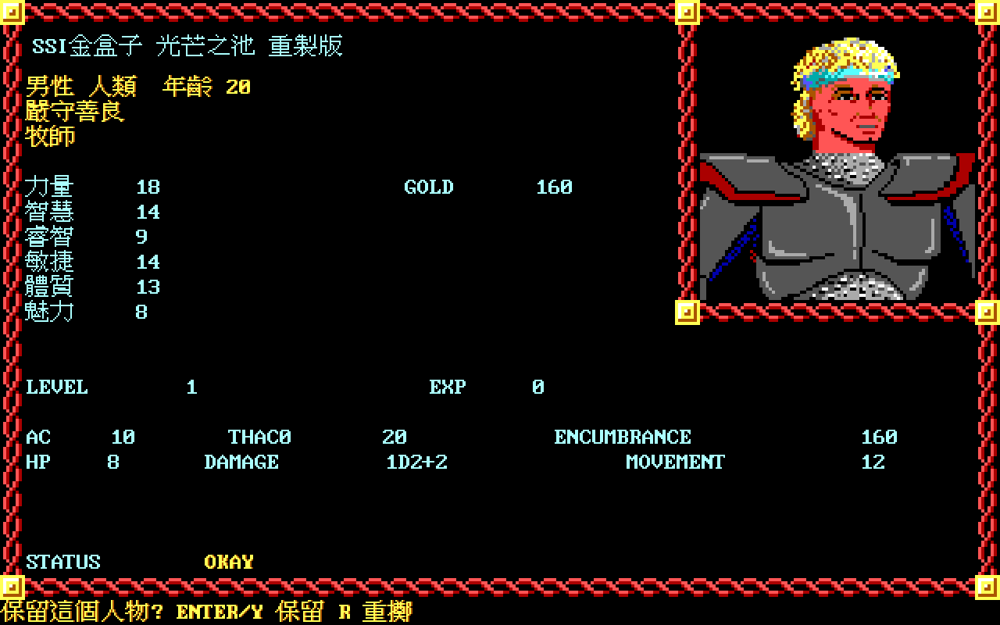 |

| 肖像編輯器（原版 HEAD／BODY 素材） | 戰鬥圖示編輯器（原版 READY／ACTION 素材） |
|---|---|
| 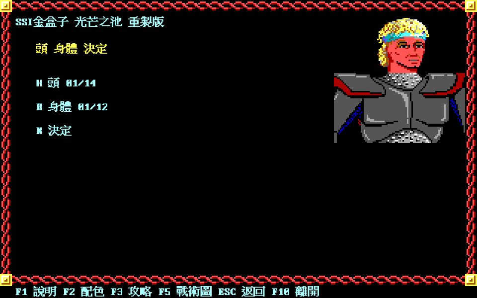 | 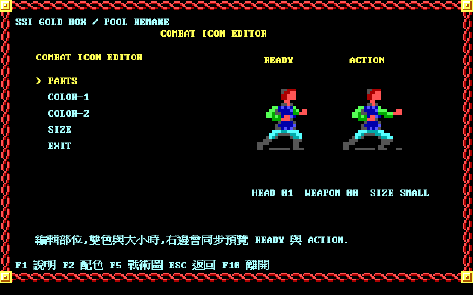 |

`人物管理選擇項`那一張是九項：`C D M V A R S B E`，**沒有 `T)RAIN`**。
那不是漏做——原版 `T` 的啟用旗標 `DS:06D4h` 只有在訓練所那一區才會設起來
（[spec 008](docs/spec/008-character-library-and-party-menu.md)），這張圖不在訓練所裡。

### 冒險

| 隊伍組好，準備開始 | 羅夫導覽（原版敘事，繁中） |
|---|---|
| 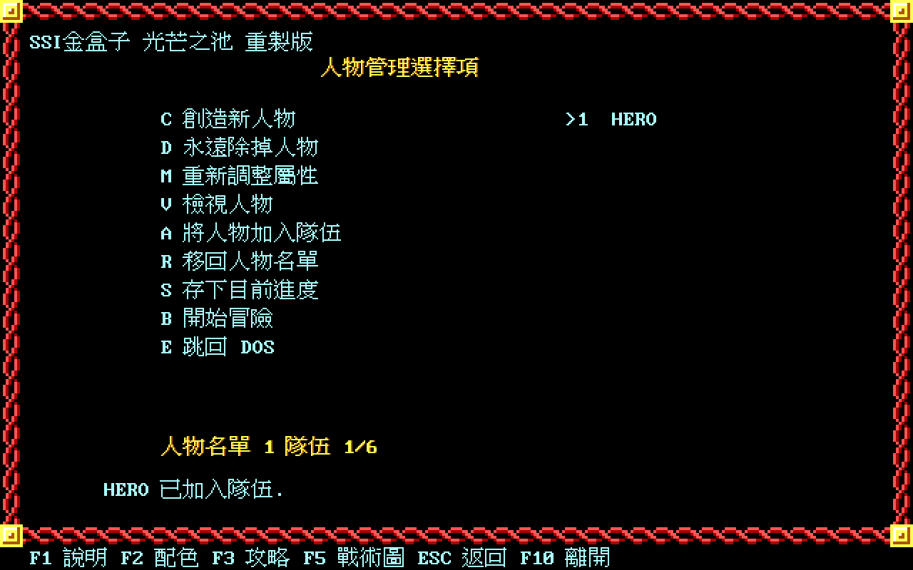 | 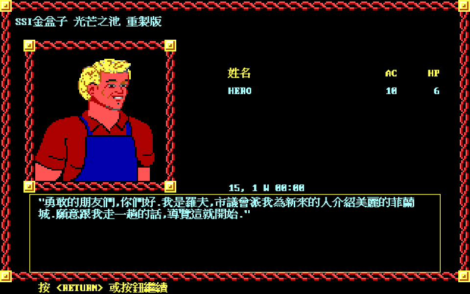 |

| 導覽按完之後的自由移動 | `A` 開平面圖 |
|---|---|
| 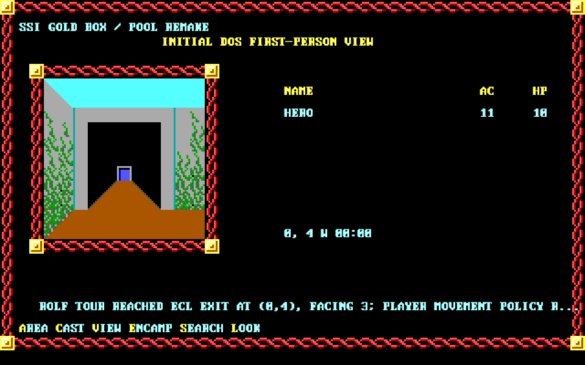 | 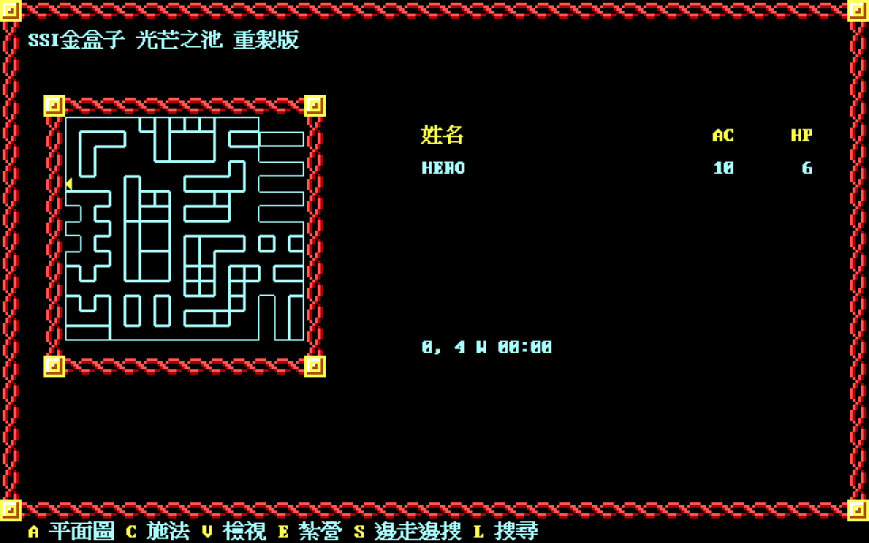 |

第一人稱那一格是由目前地城座標與原版 GEO 牆面資料現場合成的，
與原版 DOS 的同一格同一朝向**逐格 100% 相同**（7744/7744，兩張基準圖，
[spec 126](docs/spec/126-first-person-inset-pixel-parity.md)）。

### 面板

| `J` 探險者手冊：線索報導 46 | `I` 裝備頁 |
|---|---|
| 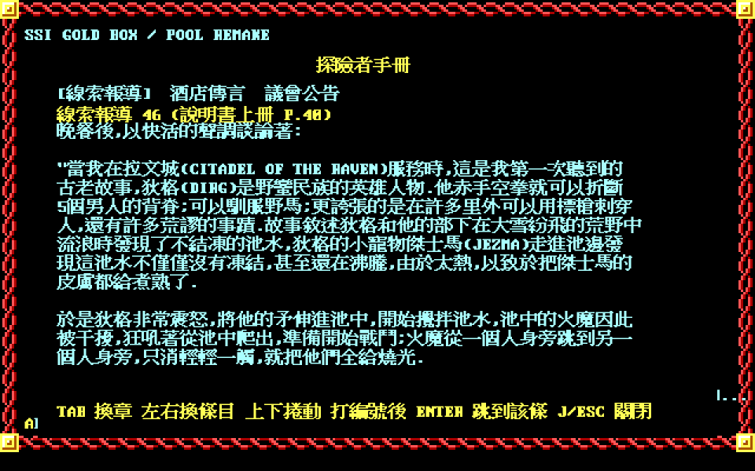 | 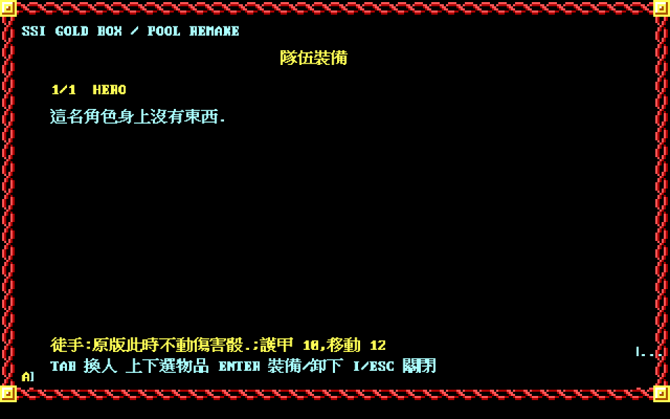 |

| `K` 法術一覽：巫術第 1 級 | `F5` 戰術盤面 |
|---|---|
| 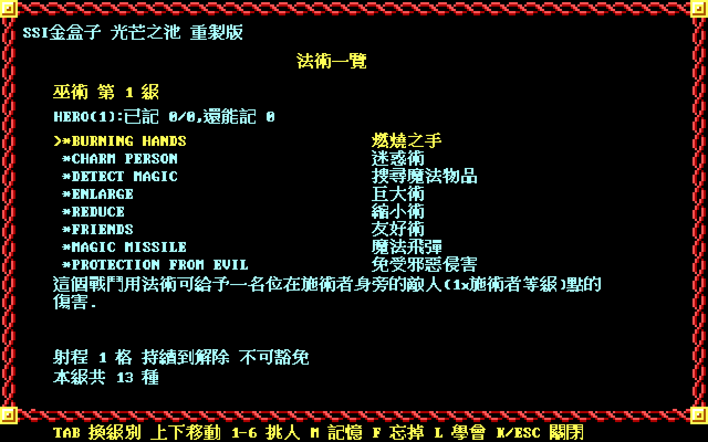 | 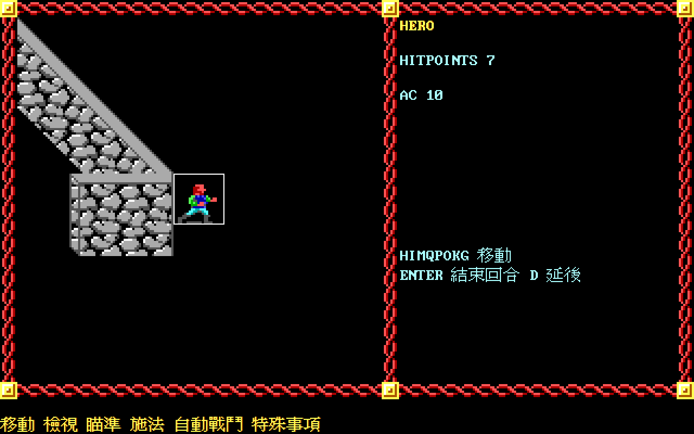 |

手冊那一張是說明書上冊的線索報導 46，遊戲文字裡「抄進手冊，成為線索報導 46」
說得出口，翻得到就是翻得到。法術頁列的是巫術第 1 級 13 種，原文名與譯名並列，
底下是該條的說明、射程、持續與豁免——六十七支法術全部接完了。

戰術盤面是由目前地城座標與真實 GEO 牆面資料現場生成的 50×25 戰術格；牆呈斜線是
投影本身的形狀（`X = 21 + 6dx + 5dy + subB`）。原版 Move 命令的八個方向鍵
（`H I M Q P O K G`）已接上移動判定，回合流程照
[spec 062](docs/spec/062-combat-round-loop.md) 的順序在跑。

目前以 Docker／Xvfb 做離線測試與煙霧擷取：

```sh
tools/go.sh test ./...
```

`tools/go.sh` 會在測試容器內自行建立有界 Xvfb。可互動封包尚未完成；本階段不把
主機 X11 socket 掛入開發容器，也不把只在背景 Xvfb 執行的入口寫成玩家啟動方式。

這仍是首條玩家垂直鏈。remake 自有角色庫、建隊、穩定邊界存讀檔、初始 map identity、
Rolf 導覽、Sune／City Hall 早期事件與 Slums 戰鬥前 staging 已接通；DOS 相容角色檔、
完整 Party Creation Menu、Pool 專屬視錐 oracle、Rolf 初次 APPROACH 圖像、全部鎖門／
地圖事件、完整戰術戰鬥、對話／服務／戰鬥中途續點及主線破關仍未完成。

## 授權、致謝與聲明

本專案中由權利人擁有的程式碼、繁體中文翻譯、文件、反組譯規格與工具採
[RRSAL-1.0](LICENSE)（復古重製 source-available 授權條款 1.0）：非商業用途免費，
包含修改與再散布；遊戲實況、錄影、直播與其平台分潤由條款第 4 條明示允許；商業
用途請另行洽談。這是 **source-available**，不是開源——非商業限制不符合 OSI 的
開源定義。

授權**不涵蓋**原版素材：SSI／Strategic Simulations, Inc. 的《Pool of Radiance》
遊戲、商標、圖像、音樂與資料檔；軟體世界代理當年的官方繁中說明書譯文；
倚天中文系統的點陣字型。完整界線見 [`NOTICE.md`](NOTICE.md)。
