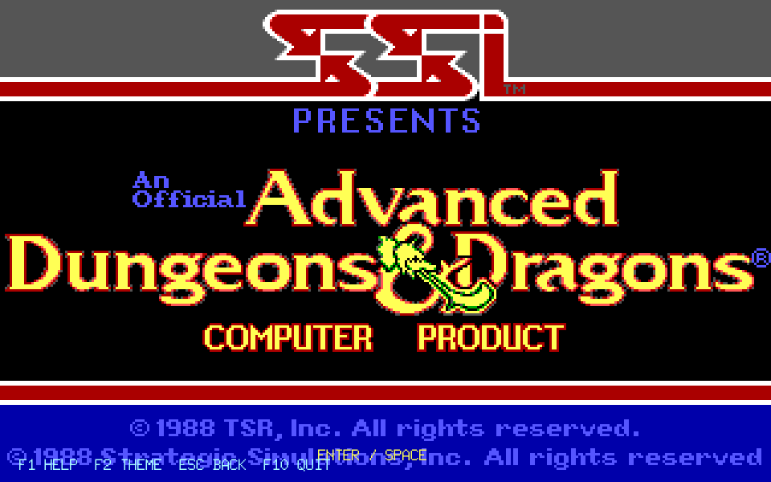
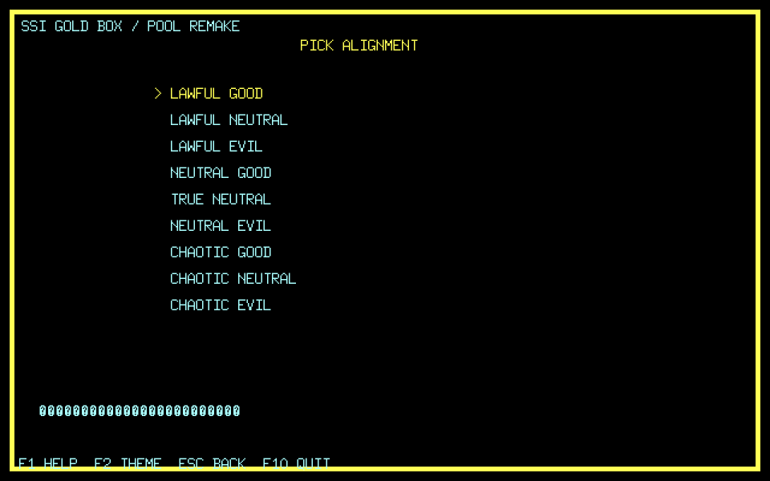
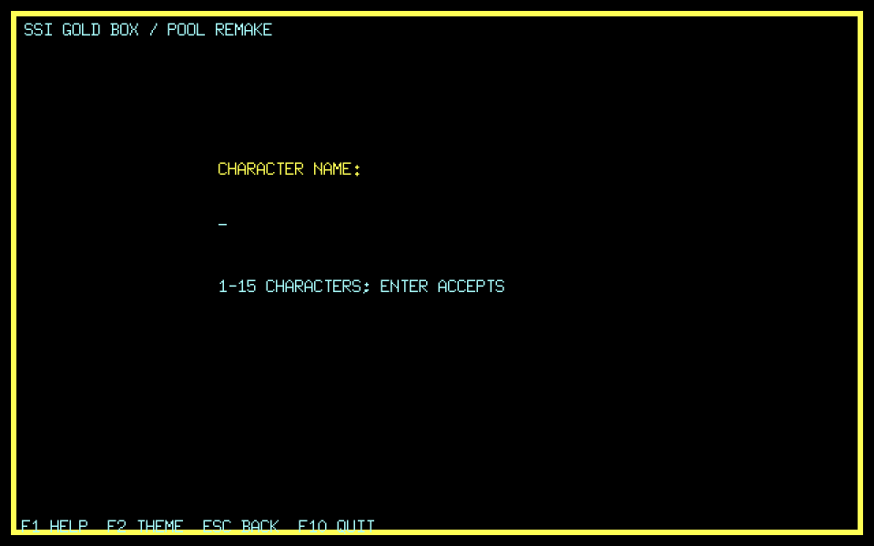
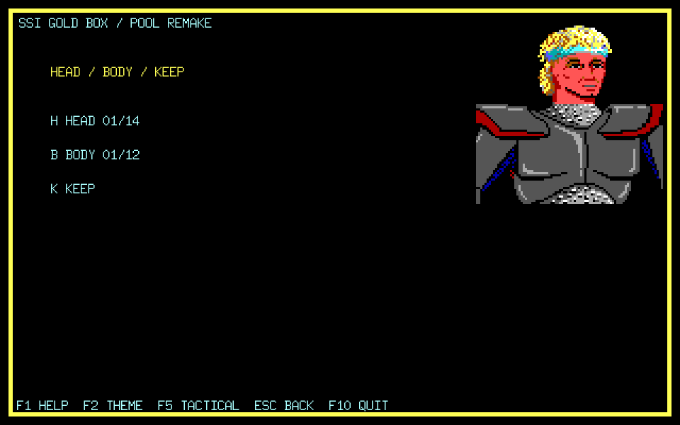
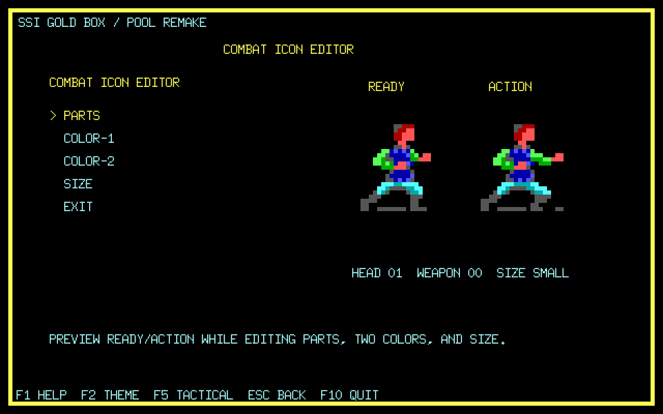
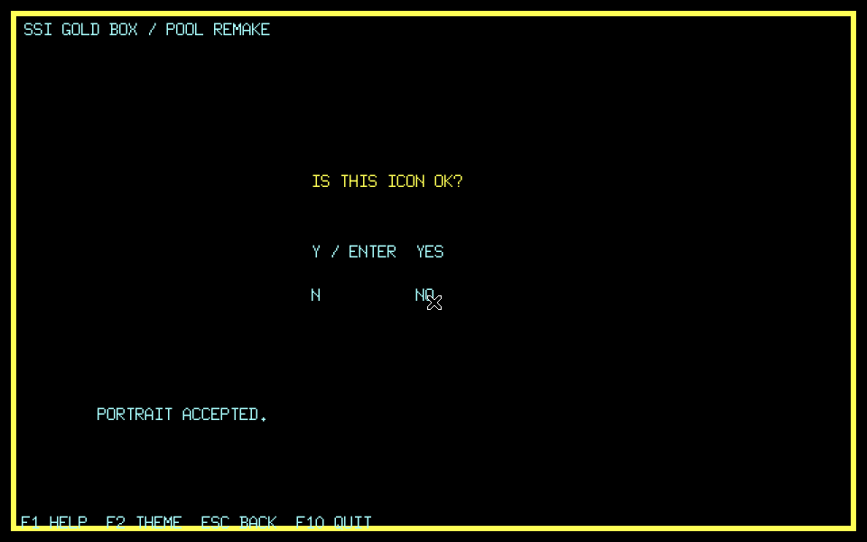
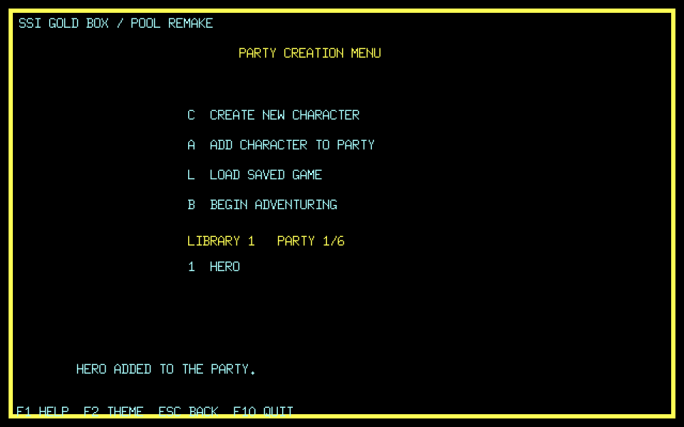
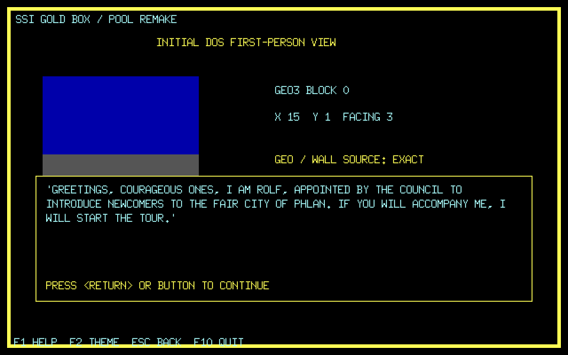
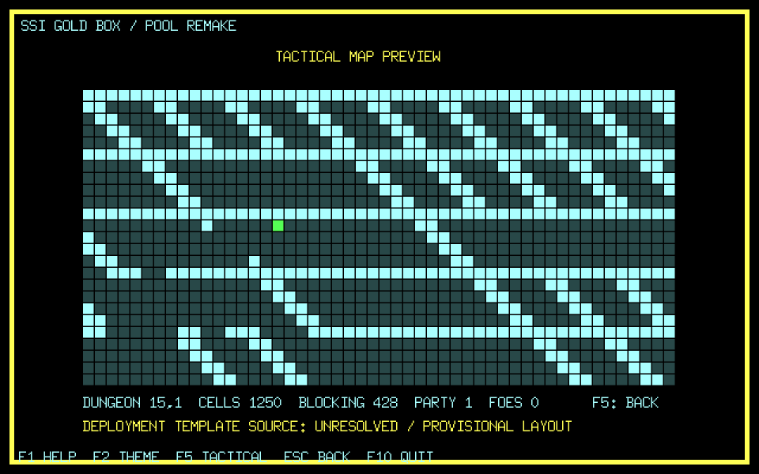
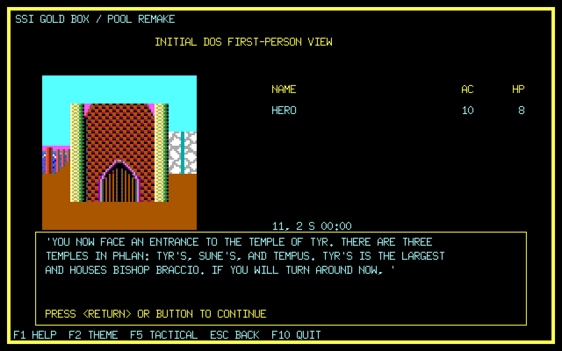

# Pool of Radiance 繁體中文 Remake

本專案以 SSI《Pool of Radiance》DOS 版為主要行為 oracle，建立可跨平台、
可從開場玩到結局的繁體中文 remake。目前已能從標題正常完成建角／建隊、
進入 Phlan 初始地圖、走過 Rolf 導覽與早期城市事件，並抵達第一場真實 Slums
遭遇的失敗即關閉（fail-closed）戰鬥 staging；完整戰術戰鬥與主線仍未完成，
因此尚不可宣稱可玩版或與原版 parity。

以「完整繁中、正常主線可破關、三平台可發行」為分母，目前保守工程估計為
**20～25%**，其餘約 **75～80%**。這是依玩家垂直鏈與交付硬門檻
估算，不是用規格文件數量換算；細節與未知項以 [CONTEXT.md](CONTEXT.md) 為準。

## 現況

- 遊戲畫面已有第一段繁中：標題提示、人物管理選擇項，以及建角的四個選單、
  人物資料頁與姓名輸入。用詞一律取自軟體世界代理當年的官方中文說明書
  （種族、性別、四種職業、九個陣營、六項屬性），不是重新翻譯。字型用倚天
  16x15 點陣字，屬第三方資產、不進 repo，執行時以 `-eten-font` 指定；
  `-lang zh` 沒有字型會失敗即關閉，不會默默用英文跑。截圖見
  `docs/screenshots/pool-remake-chinese-*.png`。
- 遊戲內的敘述文字**全部翻完**。原版的 ECL 文字盤點下來共 **1,731 句、
  110,473 個字元**（`docs/audit/dos-ecl-text-inventory.json`），那就是遊戲內文字的
  翻譯總量，現在覆蓋率是 **1,731 句（100%）／110,473 字元（100%）**：八個 ECL
  封存檔的敘述、對話、選單選項與怪物名一句不漏。譯文以原文整句為鍵放在
  `internal/gametext`，原版檔案一個位元組都不改。覆蓋率由
  `cmd/pool-text-inventory -coverage` 量出來，譯文表出現盤點檔沒有的原文時失敗即關閉；
  另有測試拿盤點檔逐條核對每個原文都真的存在。用詞以軟體世界的官方說明書與
  探險者手冊為準，說明書沒收的專名逐條記在 `docs/reference/manual/glossary.md`。
  戰術畫面已中文化。
- **探險者手冊進遊戲了**：說明書上冊的線索報導 58 條、酒店傳言 23 條與議會公告
  18 則共 99 條，由 `cmd/pool-journal-corpus` 從轉錄稿切成
  `internal/journal`，遊戲裡按 `J` 開啟，直接打編號就跳到那一條。畫面說
  「成為線索報導 46」時，玩家不必再去找三十多年前的紙本說明書。
  下冊附錄的規則表（金錢換算、法術表、武器表）還沒接。
- **武器會影響戰鬥了**：物品型別表不在執行檔裡（`DS:54E0h` 那段是未初始化的），
  來源是 ZIP 的 `poolrad/items`。索引由墓園那把 `Two-Handed Sword +1` 正對照
  釘住：它的記錄寫 `+2Eh = 26h`，而表的第 `26h` 筆正是雙手劍的 1d10／3d6。
  力量與敏捷的四張修正表逐分支照抄自 overlay-25。按 `I` 裝上武器之後，
  戰術戰鬥的 THAC0 與傷害骰由武器決定，不再是 placeholder。契約見 spec 065。
- 已固定 DOS ZIP、歷史中文 RAR 與八張 D64 輸入雜湊。
- 已盤點 DOS ZIP 168 個檔案；包含 `START.EXE`、`GAME.OVR`、八組
  ECL／GEO／WALLDEF／PIC／SPRIT DAX 與角色存檔樣本。
- engine `dax` 已成功解析 113／113 個 DAX、合計 1,245 blocks，Pool 已成為
  該 codec 的第二個真實作品 consumer；payload 語意仍待逐項驗證。
- 已用未修改 DOS 程式建立穩定標題與主選單 oracle；`TITLE.DAX` block 1 經
  typed adapter 匯出、2× 最近鄰呈現後，與原版標題逐像素 AE=`0`。
- ECL payload 映射基準已由原版 loader／resolver 閉合為 `9900h`；`9914h` 是五個
  command-set headers 之後的第一條指令位址。勘誤後 26／29 blocks 可完整走圖、
  14,724 條 reachable instructions 可解；其餘 3 筆仍待分類。正式玩家路徑已使用
  同一 VM session 跨 ECL archive 執行目前需要的 blocks，不能把全 corpus 的三個
  graph 缺口誤寫成「production VM 尚未接」。
- 已有第一支可執行的 Ebitengine `cmd/pool-game`：讀取本機原版 ZIP 的 `TITLE.DAX`，
  可由標題以正常按鍵進入主選單並走完 Race→Gender→Class→Alignment→角色資料頁
  →姓名→原版 HEAD／BODY／KEEP 肖像編輯器→READY／ACTION 戰鬥圖示編輯器；
  F1 Help、F2 theme、ESC 返回、F10 離開與視窗拉伸已接通。戰鬥圖示使用原版
  CHEAD／CBODY，支援 Head、Weapon、Size、六部位雙色及 READY／ACTION 同時預覽。
  完成確認後會寫入版本化 remake 角色庫、回到原版順序的 Party Creation Menu；
  Add、六名玩家角色上限，以及穩定玩家邊界的 schema 6 F10／Load campaign round-trip
  已接通；對話／服務／戰鬥中途續點尚未完成。DOS 285-byte CHA／SPC export
  尚未完成。正常 `B` 已依原版 producer chain 接到 `GEO3/block 0, (15,1), facing 6`
  的 typed geometry 與原版 `WALLDEF3/8X8D3` 第一人稱素材。正常 Begin 隨即依
  ECL3/block 0 進入 Rolf 導覽第一頁：首次旗標、`(15,1), facing 3`、monster 12、
  原版 ZIP packed text 與 Return 閘門已達 exact。Spec 011 另由四張原始 byte table
  閉合並實作完整 34-step scripted tour：六個停靠 selector 顯示七頁原版文字，最後在
  `(0,4), facing 3` 走到 ECL `EXIT`。每步 delay 是可重現的約 150ms approximation；
  導覽結束後已可用方向鍵轉向，並以原始 GEO wall／door data 在 cardinal 朝向前進；
  每格 ECL dispatch 已從 Sune 神殿、City Hall 公告／委託走到跨 archive 的 Slums；
  鎖門互動、全部地圖事件與完整 Pool 移動政策仍未閉合。視錐 traversal 仍是
  跨作品共用引擎的 strong inference。
- 第一場 Slums 遭遇已從真實 ECL 載入 `MON2CHA.DAX` 的 `ORC ×1／ORC ×3`，並將
  ECL PC 停在戰後 continuation 前，不接受 Enter 假造勝利。Spec 048～053 已閉合
  285-byte 怪物戰鬥欄位、基礎命中／傷害、雙攻擊槽、先攻、移動預算、八方向步進與
  66×4 戰術格位表；Spec 056～062 再閉合戰場生成、佔格與朝向弧、直線追蹤與成本、
  目的格探測、反應攻擊閘門與回合迴圈。遭遇畫面按 Enter 即可進入戰術戰鬥：
  回合、先攻、八方向移動、攻擊、傷害、倒地與勝敗都會實際跑，勝利後由停在
  `COMBAT` 邊界的 PC 續跑戰後腳本，戰敗則依 Spec 046 契約 5 不續跑。
  先攻輪到敵方時牠們會自己行動——挑目標用 Spec 056 的鄰近成本表、每一步過
  目的格探測、撞上就攻擊，所以戰鬥是雙向的、也真的會輸。原版的怪物 AI 尚未
  反組譯，「挑哪個目標、走哪一步」是暫定策略；反應攻擊接進移動提交也還沒接上。
  部署位置與隊伍的 AC／THAC0／傷害骰同樣是暫定值（原版陣型樣板是執行期填的、
  不在檔案裡，角色記錄也還沒有那三項），全部標在畫面上。
- 原版建角已走通 portrait 與 OLD／NEW READY／ACTION combat icon；六部位雙色、
  Head、Weapon、Size 的 285-byte CHA offsets 已由 UI 單變因差分閉合。六種族的
  原版職業清單已進 typed catalog，並有 Race→Gender→Class→Alignment＋ESC 狀態機。
- 共用 engine 固定使用同層
  `/home/anr2/cht/golden_box/golden-box-remake-engine`，本 repository 不複製
  engine source。
- 第一支 `cmd/pool-inventory` 只做唯讀 ZIP／DAX 形狀盤點，不解讀劇情語意。

## 本機盤點

原版檔案不進 Git。將 `Pool of Radiance (1988).zip` 放在 repository 根目錄後，
以專案 Docker 工具鏈執行：

```sh
tools/go.sh run ./cmd/pool-inventory -zip "Pool of Radiance (1988).zip"
```

目前真相來源與下一步分別見 [CONTEXT.md](CONTEXT.md) 與
[WORKLIST.md](WORKLIST.md)；逐輪變更見 [WORKLOG.md](WORKLOG.md)；輸入盤點收據見
[docs/audit/input-inventory.md](docs/audit/input-inventory.md)。

標題格式與驗收見 [Spec 001](docs/spec/001-dos-title-picture.md)；原版啟動收據見
[DOS 標題／主選單 oracle](docs/playtest/dos-title-main-menu.md)。

## 目前 remake 畫面

姓名輸入至 Rolf 導覽的七張操作畫面已從真實 Ebitengine 視窗，透過 Docker／Xvfb
逐鍵重拍；標題與角色資料頁沿用較早的同一路徑收據。重拍後七張 PNG 與版控內容
逐 byte 相同；來源提交、日期、雜湊、尺寸與狀態標籤見
[截圖 manifest](docs/audit/remake-screenshot-manifest.json)。這些圖片只證明各圖所列的
正常路徑與目前畫面，不代表完整遊戲 parity。

| 標題（原版素材 typed decode） | 建角角色資料頁（Spec 003／004） |
|---|---|
|  |  |

| 姓名輸入（原版順序） | 肖像編輯器（原版 HEAD3／BODY3 素材） |
|---|---|
|  |  |

| 戰鬥圖示編輯器（原版 READY／ACTION 素材） |
|---|
|  |

| 最終確認 | 返回建隊選單並加入角色 |
|---|---|
|  |  |

| 建隊後正常按 `B` 進入原版 Rolf 導覽第一頁 |
|---|
|  |

| 冒險畫面按 `F5` 的戰術地圖預覽（Spec 060） |
|---|
|  |

這張圖是由目前地城座標與真實 GEO 牆面資料現場生成的 50×25 戰術格，1250 格全部
有內容；牆呈斜線是投影本身的形狀（`X = 21 + 6dx + 5dy + subB`）。牆面值依
overlay-10 `0138h` 分成開放、牆與門三種，界外一律當牆、只有隊伍那一列的東西向
例外。綠色是隊伍成員；這條擷取路徑上沒有 staged 怪物，所以敵方是 0。

原版 Move 命令的八個方向鍵（`H I M Q P O K G`）已經接上移動判定，回合流程也照
Spec 062 的順序在跑：每回合重設所有人的移動預算、重擲先攻，再反覆「選行動者→
行動」，選不到人才進下一回合——先攻是每次行動後重選，不是整場排一次順序表。
`Enter` 結束回合，`D` 是原版的 Delay（分數寫成 1 而非 0，稍後還會被選到）。

圖中的狀態是按了兩次正東再按一次右上斜向之後：預算由 24 扣成 20（兩步正東、
每步 2），第三步因為右上那格在牆線上而回報 `BLOCKED`。撞到人會走攻擊分支，
走出盤面會走離開戰鬥的詢問分支。

兩處仍是暫定的，都標在畫面上：部署位置由原版執行期填的陣型樣板決定，那張表不在
檔案裡（Spec 061）；移動預算與怪物的 DEX 在沒有 staged 怪物時用暫定值，因為
remake 的角色記錄還沒有移動欄位。來源提交與雜湊見
[戰術預覽截圖 manifest](docs/audit/remake-tactical-screenshot-manifest.json)。

| Rolf 34-step 導覽的 Tyr 停靠點（正常 Return 路徑） |
|---|
|  |

目前以 Docker／Xvfb 做離線測試與煙霧擷取：

```sh
tools/go.sh test ./...
```

`tools/go.sh` 會在測試容器內自行建立有界 Xvfb。可互動封包尚未完成；本階段不把
主機 X11 socket 掛入開發容器，也不把只在背景 Xvfb 執行的入口寫成玩家啟動方式。

這仍是首條玩家垂直鏈。remake 自有角色庫、建隊、穩定邊界存讀檔、初始 map identity、
Rolf 導覽、Sune／City Hall 早期事件與 Slums 戰鬥前 staging 已接通；DOS 相容角色檔、
完整 Party Creation Menu、Pool 專屬視錐 oracle、Rolf 初次 APPROACH 圖像、全部鎖門／
地圖事件、完整戰術戰鬥、對話／服務／戰鬥中途續點及主線破關仍未完成。
