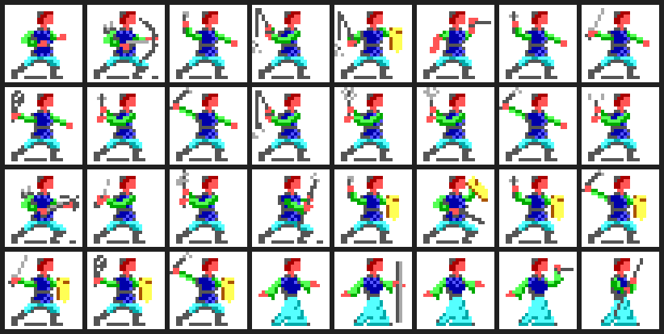
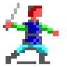
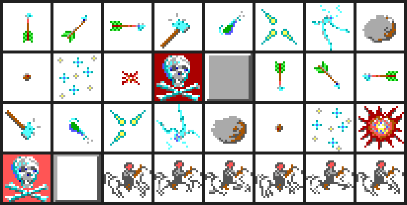

# 怪物圖鑑

DOS 版《Pool of Radiance》把每一隻能上戰場的角色——不管是哥布林還是穿著
盔甲的衛兵——都存成同一種 285-byte 記錄，分裝在 `MON1CHA.DAX`…`MON8CHA.DAX`
八個檔案裡（[spec 048](../spec/048-monster-record-and-precombat-staging.md)）。
八個檔案合計 172 筆記錄、103 個不同名稱；同一個名稱在不同檔案裡重複出現，
是因為原版把「哪一批怪物會在哪一章節遇到」拆到各章自己的檔案，不是資料重灌。

103 個名稱裡，103 個的中文譯名已經在 `internal/gametext/monsters.zh-TW.json`
定案（遊戲戰鬥畫面會顯示），本文直接沿用，不重新翻譯。

怪物在戰場上的實際造形是 `CBODY.DAX` 的三十二種身體，各配同一顆頭
（`CHEAD.DAX` block 1）合成——跟玩家角色共用同一套「頭＋身體」造形系統，
只是配色不同（`cmd/pool-game/sprite_overview.go` 的 `drawMonsterOverview`
已經這樣畫）。`COMSPR.DAX`／`ICON.DAX` 則是另一組資料：三十二張站立／動作
圖，內容是箭、飛斧、擲石、閃光、爆炸這類戰鬥特效與狀態圖示，不是怪物造形，
細節見下面〈戰場造形〉與〈戰鬥特效與狀態圖示〉兩節。

## 資料來源與怎麼重生

- DOS ZIP：`Pool of Radiance (1988).zip`，SHA-256
  `1a7386c3842d3c6b0d02d9e607af249b2b452adb396a17f0971d09b2346b1633`。
- 匯出工具：[`cmd/pool-monster-atlas`](../../cmd/pool-monster-atlas)，收據在
  [`docs/audit/monster-atlas.json`](../audit/monster-atlas.json)。全部 PNG 由
  程式直接從 `CBODY.DAX`／`CHEAD.DAX`（戰場造形，呼叫既有 production code
  `internal/assets` 的 `ReadCombatIcon`）與 `COMSPR.DAX`／`ICON.DAX`（戰鬥
  特效）解出來，沒有手工貼圖；`COMSPR.DAX`／`ICON.DAX` 有哪些 block 存在是
  掃檔案本身得到的，不是照著舊清單假設。
- 重生指令：

  ```
  tools/go.sh run ./cmd/pool-monster-atlas \
    -zip "Pool of Radiance (1988).zip" \
    -img-out docs/archaeology/img/monsters \
    -receipt docs/audit/monster-atlas.json
  ```

  會覆寫 `docs/archaeology/img/monsters/` 底下全部 PNG 與收據 JSON。

- 數值部分呼叫既有 production code
  （`internal/gamepack/monster.go` 的 `MonsterRecord` 系列 accessor），不重新
  解析 byte layout；THAC0 用 `CombatThac0Internal()`（含力量修正）換算成表面
  值，原因是樣板記錄的 `+110h` 欄位多半是殘值，`internal/gamepack/monster.go`
  的註解與 `docs/audit/monster-thac0-template-scan.json` 已經逐筆核對過。
- 效果節點來自對應的 `MONxSPC.DAX`（`gamepack.ReadDOSMonsterEffects`）；
  `MON1SPC.DAX`／`MON3SPC.DAX` 在原版 ZIP 裡本來就不存在，這兩個 archive 的
  怪物一律沒有效果節點可查，不是掃描遺漏。
- 推論等級沿用專案慣例：`exact`（遊戲內文字或說明書原文直接用過這個中文名，
  或數值逐位元組讀出）、`strong inference`（由已定名的成分組出，或多條證據
  互相印證但沒有逐位元組核對）；本文另外用「未查」標「連線索都沒有，不強行
  猜」的項目。中文譯名後面的 ✓／△ 分別對應這兩級，定義見
  `internal/gametext/monsters.zh-TW.json`。

## 怎麼讀數值表

- **HP**：`MON*CHA.DAX` 樣板裡已經擲好的生命值上限（`+32h`），不是骰式。
- **AC**：數字愈小護甲愈好（AD&D 慣例，10 是沒有防護）。
- **THAC0**：打中 AC 0 需要擲出的骰面，數字愈小愈準。
- **攻擊**：每種攻擊形態的傷害骰，乘號後面是每回合次數；`×1.5` 代表兩回合打
  三次（原始欄位存的是「次數×2」，見 `internal/gamepack/monster.go`）。部分
  怪物的第一種形態沒有骰子（傷害在第二種形態上，是原版把特殊攻擊擺在第一
  格的緣故），本文只列有骰子的形態。
- **移動**：12 是未負重人類的基準值，數字愈大愈快
  （[spec 079](../spec/079-movement-rate.md)）。三隻怪物（ORC、VAMPIRE、
  TYRANITHRAXUS）在不同 archive 裡數值不同，是原版同名怪物在不同章節換了
  強度模板，不是資料錯誤，表裡用「/」列出全部觀測值。
- **位置**：`archive/block`，對回 `MON<archive>CHA.DAX` 的第 `block` 筆記錄，
  可以直接用 spec 048 的方法逐筆核對。

## 出現在哪裡

`docs/audit/dos-ecl-scripted-fights.txt` 是既有的 ECL 靜態遭遇掃描結果，記錄
每個 ECL 區塊裡「劇本寫死」的戰鬥組合。archive 編號與 ECL 書號一一對應（同一
份 `LOAD MONSTER` 運算元同時是 archive 內的 block 編號），所以能直接拿本文的
`archive/block` 去比對出現地點。103 個名稱裡有 78 個至少能在該表裡找到一次
出現紀錄，本文的分類表格把找得到的區域名附在個別段落；找不到的不代表「不會
遇到」，只代表沒有出現在那份**靜態**清單裡——原版還有隨機遭遇、走路觸發與
表驅動（依旗標決定組合）的遭遇，這幾種本文沒有逐一核對，統一算「未查」。

## 戰場造形（CBODY.DAX）

怪物在戰場上跟玩家角色共用同一套「頭＋身體」造形系統：身體來自
`CBODY.DAX`（三十二種），頭來自 `CHEAD.DAX`，兩者疊合、套上配色組成
24×24 的戰鬥圖示。`cmd/pool-game/sprite_overview.go` 的 `drawMonsterOverview`
（`spritePageMonsters` 那一頁）就是這樣畫怪物總覽的：三十二種身體固定配
同一顆頭（block 1），配色用六組預設值。本節的圖直接呼叫同一套 production
code（`internal/assets` 的 `ReadCombatIcon`）產生，不是另外湊的。

（`internal/assets/monster_sprite.go` 的檔頭註解目前還把 `COMSPR.DAX` 稱作
「怪物圖形」，與這裡的結論不一致，那份註解由其他工作更新，本文不重複。）



三十二張圖按身體編號 0..31 逐張輸出成 `cbody-00.png`…`cbody-31.png`，對應
的原始 block（`assets.CombatIconBlockIDs` 算出來的）與檔名列在收據 JSON 的
`bodies.bodies`；身體 block 落在 `40h`–`5Fh`，頭固定是 `41h`。

ECL `LOAD MONSTER` 第三個運算元（`MonsterSpawn.IconBlock`）目前查到的幾個
實際數值，跟三十二種身體的索引範圍（0..31）對照如下：

| 怪物 | `LOAD MONSTER` 第三運算元 | 落在 0..31 內 | 出處 |
|---|---:|:---:|---|
| KOBOLD LEADER（小妖魔首領）| 1 | 是 | `cmd/pool-game/norris_fight_receipt_test.go`（ECL8/29 `9DDBh` 原始 bytes 已逐位元組核對）|
| GOBLIN GUARD（惡鬼守衛）| 2 或 4 | 是 | `docs/audit/dosgolem-deployment-peek-alarm.json`（2）；`cmd/pool-game/deployment_templates_receipt_test.go` 哥布林那一場另外配 4 |
| GOBLIN LEADER（惡鬼首領）| 3 | 是 | `docs/audit/dosgolem-deployment-peek-alarm.json` |
| ORC（半獸人）| 4 | 是 | `internal/gamepack/eclvm_test.go` `TestRealSlumsEncounterCarriesMonsterRosterToCombatBoundary`；`docs/audit/dosgolem-deployment-peek-guards.json` |
| ORC LEADER（半獸人首領）| 5 | 是 | `docs/audit/dosgolem-deployment-peek-orc-home.json`、`dosgolem-deployment-peek-guards.json` |
| NORRIS THE GRAY（挪里斯）| 7 | 是 | `cmd/pool-game/norris_fight_receipt_test.go` |
| LIZARDMAN（蜥蜴人）| 57 | 否 | 同上；57 超出 0..31，對應規則未查——不強行湊進三十二種身體，也不假設它落在哪一種家族（`CombatIconBlockIDs` 的 size／action 家族偏移是 `00h`／`40h`／`80h`／`C0h`，57(`39h`) 不落在任何一個家族的合法子範圍） |

前六筆的運算元值都落在 0..31，跟「三十二種身體」的索引範圍相容，可以直接
拿收據 JSON 裡對應的 `cbody-<運算元兩位數>.png` 對照著看，例如挪里斯（7）：



「相容」不等於「證實」——本文沒有去讀 overlay 裡實際使用 `IconBlock` 的那段
組合語言，不主張運算元值等於身體索引這件事本身是 exact，只列出這個對照
關係是 `strong inference`。LIZARDMAN 那筆（57）本身無法用這個假設解釋，如實
標「未查」。其餘 96 個名稱沒有查到 `LOAD MONSTER` 第三運算元的直接證據。

## 戰鬥特效與狀態圖示（COMSPR.DAX／ICON.DAX）

`COMSPR.DAX`（十三組）與 `ICON.DAX`（三組，各含站立／動作兩張 24×24 圖，
合計 32 張）裝的是戰鬥特效與狀態圖示——箭、飛斧、擲石、閃光、爆炸，外加
一個紅底骷髏交叉骨與一個騎馬人像，不是怪物造形。收錄在這裡是把它們的
內容如實記下來，供之後查證特效顯示邏輯時當索引，不是怪物圖鑑的主要內容。



總覽圖每一格對應收據 JSON 裡 `overview_grid_order` 的同一個索引，順序是先
`COMSPR.DAX`（站立 0..0Bh、19h，接著動作 80h..8Bh、99h），再 `ICON.DAX`
（站立 00h..02h，接著動作 80h..82h）。單張檔名可以直接從收據的
`sprites.comspr.blocks[].file` 查。`ICON.DAX` 的三組在既有程式碼註解裡沒
提過帶動作態，這次直接掃 DAX 檔案發現它們其實也有 `80h` 偏移的動作圖——
一個超出既有文件記載範圍的新觀測，標 `exact`（直接掃到，非猜測）。

## 人形部隊模板（38 種）

原版把大量士兵、僧侶、法師、盜賊寫成「等級＋職業」的樣板，同一個樣板在
好幾個地區重複出現（例如「四級戰士」在文明區、城堡外圈、贊特爾前哨都當
守衛用）。這批怪物機制上都一樣：沒有特殊攻擊節點、移動力清一色 12（未負重
人類），差別只在 HP／AC／THAC0／傷害骰，數字愈高的等級愈難打。隊伍打不過
時，先看 AC 與 THAC0——AC 2 以下、THAC0 12 以下的樣板（六級戰士、八級戰士）
已經是能穩定命中隊伍前排、又不容易被打中的對手，適合留到隊伍練到中後期
再挑戰。

| 原文 | 中文 | 位置(archive/block) | HP | AC | THAC0 | 攻擊 | 移動 |
|---|---|---|---:|---:|---:|---|---:|
| 1ST LVL CLERIC | 一級牧師△ | 5/90 | 8 | 10 | 20 | 1d4×1 | 12 |
| 1ST LVL THIEF | 一級小偷△ | 3/45、5/45、6/45 | 4 | 6 | 20 | 1d6×1 | 12 |
| 2ND LVL CLERIC | 二級牧師△ | 7/78 | 8 | 10 | 20 | 1d4×1 | 12 |
| 3RD LVL FIGHTER | 三級戰士△ | 6/100 | 18 | 8 | 18 | 1d8×1 | 12 |
| 4TH LVL FIGHTER | 四級戰士△ | 1/41、3/41、5/41、6/41、7/41 | 30 | 8 | 17 | 1d8×1 | 12 |
| 5TH LVL FIGHTER | 五級戰士△ | 6/101 | 39 | 9 | 15 | 1d8×1 | 12 |
| 5TH LVL MU | 五級魔法師△ | 2/89 | 20 | 9 | 20 | 1d4+2×1 | 12 |
| 6TH LVL FIGHTER | 六級戰士△ | 1/75、2/75、3/84、5/75、5/84、7/75 | 45 | 2 | 12 | 1d8+2×1 | 12 |
| 6TH LVL THIEF | 六級小偷△ | 3/51、5/93、6/51 | 28 | 6 | 19 | 1d6×1 | 12 |
| 7TH LVL CLERIC | 七級牧師△ | 3/83 | 42 | 8 | 16 | 1d6×1 | 12 |
| 7TH LVL DW FIGH | 七級矮人戰士△ | 7/76 | 50 | 4 | 13 | 1d8+2×1 | 12 |
| 7TH LVL FIGHTER | 七級戰士△ | 7/80 | 50 | 8 | 13 | 1d8+2×1 | 12 |
| 7TH LVL THIEF | 七級小偷△ | 7/77 | 28 | 6 | 19 | 1d6×1 | 12 |
| 8TH LVL FIGHTER | 八級戰士△ | 3/85、5/85 | 87 | 6 | 12 | 1d8+2×1.5 | 12 |
| ACOLYTE | 見習僧侶✓ | 3/108 | 8 | 10 | 20 | 1d4×1 | 12 |
| AIDES | 副官△ | 2/53、3/53、6/53、7/53 | 18 | 8 | 18 | 1d8×1 | 12 |
| BANDIT | 盜匪✓ | 6/97、7/97 | 6 | 6 | 19 | 1d6×1 | 12 |
| BUCCANEER | 海盜✓ | 6/99 | 4 | 10 | 20 | 1d8×1 | 12 |
| CAPTAIN | 隊長✓ | 6/102 | 110 | 7 | 10 | 1d8×1.5 | 9 |
| COMMANDANT | 指揮官✓ | 6/50 | 100 | 5 | 10 | 1d8×1.5 | 9 |
| CORPORAL | 下士△ | 3/54、6/54 | 13 | 6 | 20 | 1d8×1 | 12 |
| CURATE | 教士✓ | 3/112 | 26 | 9 | 18 | 1d4+2×1 | 12 |
| DWARVEN FIGHTER | 矮人戰士△ | 6/48 | 50 | 8 | 14 | 1d8×1 | 12 |
| ENVOY | 使節✓ | 5/87、8/87 | 45 | 2 | 11 | 1d8+2×1 | 12 |
| EVOKER | 咒法師✓ | 3/122 | 6 | 9 | 20 | 1d4+2×1 | 12 |
| GUARD | 守衛✓ | 6/96 | 4 | 10 | 20 | 1d8×1 | 12 |
| HERO | 英雄✓ | 3/109 | 35 | 7 | 17 | 1d8×1 | 12 |
| LEVEL 3 MU | 三級魔法師△ | 2/94、3/94、8/94 | 9 | 9 | 20 | 1d4+2×1 | 12 |
| LEVEL 5 CLERIC | 五級牧師△ | 5/91 | 29 | 10 | 18 | 1d4×1 | 12 |
| LEVEL 6 MU | 六級魔法師△ | 2/24、2/82、4/24 | 23 | 9 | 19 | 1d4+2×1 | 12 |
| MAD MAN | 瘋子✓ | 2/25 | 7 | 4 | 19 | 1d6×1 | 9 |
| MERCHANT | 商人✓ | 7/98 | 6 | 6 | 19 | 1d6×1 | 12 |
| NOMAD | 遊牧民✓ | 3/40、7/40 | 6 | 6 | 19 | 1d6×1 | 12 |
| ROBBER | 強盜✓ | 3/111 | 16 | 6 | 20 | 1d6×1 | 12 |
| SHAMAN | 薩滿△ | 7/43 | 20 | 9 | 20 | 1d4+2×1 | 12 |
| SWORDSMAN | 劍士✓ | 3/36 | 18 | 8 | 18 | 1d8×1 | 12 |
| THEURGIST | 術士✓ | 3/110 | 13 | 9 | 20 | 1d4+2×1 | 12 |
| WARRIOR | 戰士✓ | 3/103 | 13 | 10 | 20 | 1d8×1 | 12 |

## 命名人類角色（10 種）

跟上一節同樣是人形模板，但掛了專屬姓名，多半是劇情裡會被提到或認出的
角色。FERRAN MARTINEZ（費瑞·馬提茲）、HASSAD（哈薩德）AC 都到 2，移動力
30——比正規部隊快得多，正面對抗前先確認隊伍有沒有辦法追上或先手。
NORRIS THE GRAY（挪里斯）是古托井井底那場的頭目，數值本身不算強
（HP 25、AC 7），真正的難度在於他身邊固定帶 5 隻蜥蜴人與 9 隻狗頭人首領
（見上面〈戰場造形〉一節的收據），是以量取勝的遭遇，見
[`cmd/pool-game/norris_fight_receipt_test.go`](../../cmd/pool-game/norris_fight_receipt_test.go)。

| 原文 | 中文 | 位置(archive/block) | HP | AC | THAC0 | 攻擊 | 移動 |
|---|---|---|---:|---:|---:|---|---:|
| AL-HYAM DAZID | 阿爾-海姆·達齊德✓ | 5/86、6/86 | 22 | 9 | 19 | 1d4+2×1 | 12 |
| DIANE | 黛安△ | 7/79 | 20 | 9 | 20 | 1d4+2×1 | 12 |
| DIRTEN | 迪爾騰✓ | 1/107、3/107 | 26 | 9 | 18 | 1d4+2×1 | 12 |
| FERRAN MARTINEZ | 費瑞·馬提茲✓ | 4/19 | 38 | 2 | 12 | 1d8×1 | 30 |
| GENHEERIS | 根赫里斯✓ | 5/88 | 22 | 9 | 19 | 1d4+2×1 | 12 |
| GRISHNAK | 格里希納克✓ | 4/28 | 24 | 5 | 13 | 1d4×1 | 9 |
| HASSAD | 哈薩德✓ | 7/42 | 45 | 2 | 12 | 1d8+2×1 | 12 |
| NORRIS THE GRAY | 挪里斯✓ | 8/32 | 25 | 7 | 14 | 1d3×1 | 9 |
| PRINCESS FATIMA | 法蒂瑪公主✓ | 4/104、8/104 | 33 | 6 | 17 | 1d3×1 | 12 |
| YARASH | 亞拉斯✓ | 7/81 | 27 | 9 | 19 | 1d4+2×1 | 12 |

FERRAN MARTINEZ 與 SPECTRE（幽魂）共用效果代碼 `56h`（吸取兩級，見下面
〈特殊攻擊與抗性〉），數值上是活人卻帶不死系的吸取節點，本文只如實記錄，
不猜測劇情原因（可能是不死化或詛咒相關的劇情角色，但 MON*CHA 記錄本身
證明不了這一點）。

## 半獸人與類人族（16 種）

新手隊伍最先遇到、也最常遇到的一批：哥布林、半獸人、大惡鬼、狗頭人、
熊地精、土狼人、食人鬼、雙頭巨魔、巨魔。這批怪物大多沒有特殊攻擊節點
（巨魔例外，見下），威脅主要來自數量——`docs/audit/dos-ecl-scripted-fights.txt`
裡「靜態遭遇」欄位最大值常常是幾十隻半獸人／哥布林一次湧出，單隻數值反而
不高。巨魔（TROLL）與其他人形怪不同：牠有 `64h`／`65h` 兩個效果代碼，
其中一個很可能對應 AD&D 巨魔的再生能力，但 spec 112 目前沒有把這兩個代碼
的具體效果定名，本文標「未查」，不假設「巨魔會再生」這件事在這個 remake
裡已經實作。

| 原文 | 中文 | 位置(archive/block) | HP | AC | THAC0 | 攻擊 | 移動 |
|---|---|---|---:|---:|---:|---|---:|
| GOBLIN GUARD | 惡鬼守衛△ | 1/2、2/2 | 4 | 7 | 19 | 1d6×1 | 6 |
| GOBLIN LEADER | 惡鬼首領△ | 1/3、2/3、2/12 | 7 | 5 | 19 | 1d6×1 | 6 |
| HOBGOBLIN | 大惡鬼△ | 1/6、2/6、4/6 | 6 | 5 | 18 | 1d8×1 | 9 |
| HOBGOBLIN LDR | 大惡鬼首領△ | 1/7、2/7、4/7 | 6 | 5 | 18 | 1d8×1 | 9 |
| ORC | 半獸人✓ | 1/4、1/44、2/4、2/13、4/4、7/44 | 5 | 6 | 19 | 1d8×1 | 6/9 |
| ORC LEADER | 半獸人首領△ | 1/5、2/5、2/14、2/15、4/5 | 8 | 5 | 16 | 1d8×1 | 6 |
| BUGBEAR | 熊地精△ | 2/63 | 16 | 5 | 16 | 2d4×1 | 9 |
| GNOLL | 土狼人△ | 2/73、8/73 | 10 | 5 | 16 | 2d4×1 | 9 |
| KOBOLD | 小妖魔✓ | 2/0、7/0、7/123、8/0 | 3 | 7 | 21 | 1d4×1 | 6 |
| KOBOLD LEADER | 小妖魔首領△ | 2/1、2/11、7/1、8/1 | 4 | 7 | 19 | 1d6×1 | 6 |
| OGRE | 食人鬼✓ | 1/8、2/8、4/8 | 21 | 5 | 15 | 1d10×1 | 9 |
| OGRE LEADER | 食人鬼首領△ | 1/9 | 32 | 3 | 2 | 2d6×1 | 9 |
| ETTIN | 雙頭巨魔△ | 2/71 | 50 | 3 | 10 | 2d8×1、3d6×1 | 12 |
| TROLL | 巨魔△ | 2/31、5/31、8/31 | 36 | 4 | 13 | 1d4+4×2、2d6×1 | 12 |
| SKULLCRUSHER | 碎顱者✓ | 4/27 | 39 | 8 | 15 | 2d1+2×1 | 12 |
| QUICKLINGS | 迅捷妖✓ | 6/10 | 7 | -3 | 18 | 1d4×3 | 96 |

SKULLCRUSHER（碎顱者）只出現在卡德納紡織廠（archive 4），AC -3 的迅捷妖
（QUICKLINGS）移動力 96——是全表最快的怪物，8 倍於一般人類，正面追不上，
交戰前最好先靠遠程或法術削弱。

## 不死生物（10 種）

這批是整份圖鑑裡特殊攻擊節點最密集的類別，多半集中在瓦海登墳場
（`ecl4/10`）與卡德納紡織廠（`ecl4/2`）。WIGHT（屍妖）與 WRAITH（幽鬼）
確認帶 `55h`（吸取一級），SPECTRE（幽魂）與 VAMPIRE（吸血鬼）帶 `56h`
（吸取兩級）——這兩組是本圖鑑唯一查得到具體語意的效果代碼，出處是
[spec 096](../spec/096-monster-ai-structure.md)。VAMPIRE 另外掛了 11 個
效果代碼（全表最多），大部分未定語意，但光是等級吸取加上 AC 1、HP 最高
到 43（archive 4 block 105 那一筆），已經是本圖鑑數一數二難纏的不死系
對手。GIANT SKELETON、SKELETON、ZOMBIE 三者共用 `6Eh`／`75h`／`7Dh` 這組
代碼但沒有已知的等級吸取代碼，判斷上比屍妖／幽鬼／吸血鬼系列溫和一些，
但仍標未查，不假設「這三隻沒有狀態異常攻擊」。

| 原文 | 中文 | 位置(archive/block) | HP | AC | THAC0 | 攻擊 | 移動 |
|---|---|---|---:|---:|---:|---|---:|
| GHOUL | 餓鬼✓ | 4/72、8/72 | 10 | 6 | 16 | 1d3×2、1d6×1 | 9 |
| GIANT SKELETON | 巨大骷髏✓ | 1/22、4/22 | 28 | 2 | 15 | 4d6×1 | 12 |
| JUJU ZOMBIE | 巫毒僵屍△ | 4/29 | 24 | 6 | 13 | 3d4×1 | 9 |
| MUMMY | 木乃伊✓ | 4/114 | 33 | 3 | 13 | 1d12×1 | 6 |
| SKELETON | 骷髏✓ | 4/34 | 5 | 7 | 19 | 1d6×1 | 12 |
| SPECTRE | 幽魂✓ | 2/17、4/17 | 38 | 2 | 12 | 1d8×1 | 30 |
| VAMPIRE | 吸血鬼✓ | 1/23、4/23、4/105 | 15/43 | 1 | 12 | 1d6+4×1 | 12 |
| WIGHT | 屍妖△ | 4/20 | 23 | 5 | 15 | 1d4×1 | 12 |
| WRAITH | 幽鬼△ | 4/21 | 24 | 4 | 15 | 1d6×1 | 24 |
| ZOMBIE | 僵屍✓ | 4/35 | 10 | 8 | 16 | 1d8×1 | 6 |

## 巨人與異界生物（12 種）

這批是全圖鑑傷害骰最高的類別：FIRE GIANT（火巨人）5d6 一擊、TYRANITHRAXUS
（泰倫斯拉克斯）4d6。TYRANITHRAXUS 是主線大魔王，資料裡有兩筆完全不同的
數值（archive 5 block 66 是 AC 0／THAC0 5／HP 80／MV 24，block 92 是
AC 6／THAC0 18／HP 40／MV 12），對應牠在劇情裡的兩種型態；block 66 那一筆
數值全面壓倒 block 92，交戰前要先確認遇到的是哪一筆記錄。牠身上掛 6 個
效果代碼（`18h`／`4Fh`／`51h`／`58h`／`59h`／`6Ah`），語意本文未查，只能
確定牠不是普通近戰輸出。MEDUSA（梅杜莎）、DISPLACER BEAST（移位獸）、
PHASE SPIDER（相位蜘蛛）、DRIDER（蜘蛛精靈）都帶效果代碼，按怪物一覽表
（`docs/reference/manual/glossary.md`）的說明書描述——梅杜莎凝視石化、
移位獸攻擊位置與視覺不同步——這些多半就是牠們的招牌能力，但本文只確認
「牠們有掛某個效果代碼」，不逐一斷言代碼對應哪一種能力。

| 原文 | 中文 | 位置(archive/block) | HP | AC | THAC0 | 攻擊 | 移動 |
|---|---|---|---:|---:|---:|---|---:|
| FIRE GIANT | 火巨人△ | 5/56 | 59 | 3 | 9 | 5d6×1 | 12 |
| HILL GIANT | 山丘巨人△ | 2/55、5/55 | 41 | 4 | 12 | 2d8×1 | 12 |
| EFREETI | 伊弗利特△ | 4/70、8/124 | 55 | 2 | 10 | 3d8×1 | 24 |
| TYRANITHRAXUS | 泰倫斯拉克斯✓ | 5/66、5/92 | 40/80 | 0/6 | 5/18 | 1d6×2、4d6×1 | 12/24 |
| WYVERN | 雙足飛龍△ | 8/121 | 42 | 3 | 12 | 2d8×1、1d6×1 | 24 |
| HIPPOGRIFF | 鷹馬△ | 8/113 | 18 | 5 | 15 | 1d6×2、1d10×1 | 36 |
| DISPLACER BEAST | 移位獸△ | 7/68 | 30 | 2 | 13 | 2d4×2 | 15 |
| PHASE SPIDER | 相位蜘蛛△ | 8/116 | 35 | 7 | 13 | 1d6×1 | 6 |
| DRIDER | 蜘蛛精靈△ | 7/69 | 36 | 3 | 13 | 1d4×1 | 12 |
| MEDUSA | 梅杜莎✓ | 5/49 | 30 | 5 | 13 | 1d4×1 | 9 |
| MINOTAUR | 牛頭人✓ | 7/62、8/62 | 33 | 6 | 12 | 1d3×1、2d4×1 | 12 |
| CENTAUR | 半人馬△ | 6/67 | 20 | 5 | 15 | 1d6×2 | 18 |

## 爬行類、蟲類與野獸（16 種）

蜥蜴人系（LIZARDMAN、MUTANT LIZ-MAN、DRYTHH）集中在斯托揚諾河與野外樞紐
（archive 7）一帶，三者數值接近，DRYTHH（德萊特）是掛名個體、AC 比一般
蜥蜴人低一點（3 對 4），略難打。BASILISK（八腳蜥蜴）與 MEDUSA 共用效果
代碼 `53h`／`7Fh`——說明書把八腳蜥蜴的招牌能力寫成「凝視能把生物變成
石頭」，跟梅杜莎同一種效果代碼掛在一起算是側面印證，但本文仍只記錄代碼
本身，不代這兩個代碼下石化的結論。THRI-KREEN（昆蟲人）攻擊次數全表最多
（一回合四次 1d4，外加一次 1d4+1），單次傷害不高但累積起來不能輕忽。

| 原文 | 中文 | 位置(archive/block) | HP | AC | THAC0 | 攻擊 | 移動 |
|---|---|---|---:|---:|---:|---|---:|
| LIZARDMAN | 蜥蜴人✓ | 7/57、8/57 | 11 | 4 | 16 | 1d8×1、1d2×2 | 6 |
| MUTANT LIZ-MAN | 變種蜥蜴人△ | 7/58 | 18 | 3 | 14 | 1d10×1、1d4×2 | 6 |
| DRYTHH | 德萊特✓ | 8/95 | 18 | 3 | 11 | 1d10×1、1d4×2 | 6 |
| GIANT LIZARD | 巨型蜥蜴△ | 8/59 | 16 | 5 | 16 | 1d8×1 | 15 |
| GIANT SNAKE | 巨蛇△ | 5/60、6/60 | 25 | 5 | 15 | 3d6+2×1 | 12 |
| HUGE SCORPION | 巨大蠍子△ | 4/39 | 20 | 4 | 15 | 1d8×2、1d3×1 | 12 |
| LARGE SCORPION | 大蠍子△ | 4/18 | 10 | 5 | 15 | 1d4×2、1d1×1 | 9 |
| BASILISK | 八腳蜥蜴△ | 2/26、5/26 | 31 | 4 | 13 | 1d10×1 | 6 |
| POISONOUS FROG | 毒青蛙△ | 4/38 | 4 | 8 | 19 | 1d1×1 | 9 |
| STIRGE | 吸血鳥△ | 7/61 | 5 | 8 | 15 | 1d3×1 | 18 |
| GIANT MANTIS | 巨型螳螂△ | 6/74 | 55 | 3 | 10 | 2d6×1 | 12 |
| AHNKHEG | 掘地蟲△ | 6/65 | 40 | 2 | 12 | 3d6×1 | 12 |
| THRI-KREEN | 昆蟲人✓ | 6/118 | 33 | 5 | 13 | 1d4×4、1d4+1×1 | 18 |
| TIGER | 老虎✓ | 6/119 | 38 | 6 | 13 | 1d4+1×2、1d10×1 | 12 |
| WILD BOAR | 野猪△ | 6/120、8/120 | 18 | 7 | 15 | 3d4×1 | 15 |
| WOLF | 狼△ | 3/106、4/106 | 18 | 7 | 16 | 1d4+1×1 | 18 |

POISONOUS FROG（毒青蛙）的傷害骰只有 `1d1`（等於固定 1 點），第一次看很
弱，但牠的攻擊次數欄跟其他兩種攻擊形態沒有骰子的怪物一樣——真正的威脅
在效果代碼 `41h`，`internal/gamepack/monster.go` 的註解特別點名這隻：索寇
要塞那場四隻毒蛙對完全不還手的隊伍打了一萬多次、一次都沒扣到血，正是
因為只看第一種攻擊形態會漏掉牠真正的傷害來源。牠不是雜魚，遇到時不要
用血量數字判斷難度。

## 其他（1 種）

| 原文 | 中文 | 位置(archive/block) | HP | AC | THAC0 | 攻擊 | 移動 |
|---|---|---|---:|---:|---:|---|---:|
| MACE | 梅斯✓ | 1/33 | 25 | 7 | 17 | 1d3×1 | 9 |

MACE（梅斯）只出現在邪惡神殿／巴恩神殿（`ecl1/24`），名稱直譯是一種近戰
武器，卻是獨立的怪物記錄——傷害骰低（1d3）、移動 9，數值上更接近人形雜兵
而不是會動的武器道具。本文查不到牠在劇情或說明書裡的對應描述，維持原文
音譯，不猜測是不是動畫武器或特定角色的綽號。

## 特殊攻擊與抗性：效果代碼一覽

32 個名稱在對應的 `MONxSPC.DAX` 裡掛了效果節點（`internal/gamepack/effect_list.go`
的 9-byte 節點格式）。除了 `55h`／`56h`（等級吸取，見〈不死生物〉一節）之外，
其餘代碼的具體效果——命中／豁免／傷害怎麼修正——[spec 112](../spec/112-effect-code-dispatch.md)
只解出約 20 組的通用修正表，沒有逐碼對回「這是哪一種法術或特殊攻擊」。
本表如實列出每個名稱掛了哪些代碼，供之後查證時當索引，不代填語意。

| 原文（中文）| 效果代碼 |
|---|---|
| 6TH LVL THIEF（六級小偷）| 48h |
| AHNKHEG（掘地蟲）| 50h、79h |
| BASILISK（八腳蜥蜴）| 53h、7Fh |
| DRIDER（蜘蛛精靈）| 45h |
| EFREETI（伊弗利特）| 71h |
| FERRAN MARTINEZ（費瑞·馬提茲）| 56h、6Ch、6Dh、6Eh、6Fh、77h |
| FIRE GIANT（火巨人）| 70h、78h |
| GHOUL（餓鬼）| 44h、6Ch |
| GIANT MANTIS（巨型螳螂）| 4Dh |
| GIANT SKELETON（巨大骷髏）| 6Eh、73h、75h、7Dh |
| GIANT SNAKE（巨蛇）| 40h |
| HILL GIANT（山丘巨人）| 78h |
| HUGE SCORPION（巨大蠍子）| 40h |
| JUJU ZOMBIE（巫毒僵屍）| 5Bh、5Dh、5Eh、6Eh、75h、77h、7Dh |
| LARGE SCORPION（大蠍子）| 42h |
| MEDUSA（梅杜莎）| 40h、53h、7Fh |
| MUMMY（木乃伊）| 52h、57h、6Eh、74h、75h、77h、7Ah、7Dh |
| PHASE SPIDER（相位蜘蛛）| 25h、46h |
| POISONOUS FROG（毒青蛙）| 41h |
| SKELETON（骷髏）| 6Eh、73h、75h、7Dh |
| SPECTRE（幽魂）| 56h、6Ch、6Dh、6Eh、6Fh、75h、77h |
| STIRGE（吸血鳥）| 4Ch |
| THRI-KREEN（昆蟲人）| 43h、68h |
| TIGER（老虎）| 49h |
| TROLL（巨魔）| 64h、65h |
| TYRANITHRAXUS（泰倫斯拉克斯）| 18h、4Fh、51h、58h、59h、6Ah |
| VAMPIRE（吸血鬼）| 00h、54h、56h、62h、67h、72h、75h、76h、77h、7Dh、7Eh |
| WIGHT（屍妖）| 55h、60h、6Ch、6Dh、6Eh、6Fh、75h |
| WILD BOAR（野猪）| 63h |
| WRAITH（幽鬼）| 55h、6Ch、6Dh、6Eh、6Fh、75h、7Bh |
| WYVERN（雙足飛龍）| 40h |
| ZOMBIE（僵屍）| 6Eh、75h、7Dh |

其餘 71 個名稱在對應 archive 的 `MONxSPC.DAX` 裡沒有節點（或 archive 1／3
根本沒有 `MONxSPC.DAX`），代表牠們沒有額外的特殊攻擊效果，純粹拚基礎攻擊
與 AC／THAC0。

## 未查與限制

- **運算元值等於身體索引，只到 `strong inference`**：〈戰場造形〉列的六筆
  `LOAD MONSTER` 第三運算元都落在 0..31、跟三十二種身體相容，但本文沒有讀
  overlay 裡實際使用 `IconBlock` 的組合語言，不主張這個對應關係是 `exact`。
  LIZARDMAN 那筆（57）超出這個範圍，如實標未查，沒有另外湊一個解釋。
- **`LOAD MONSTER` 第三運算元的實際數值**：103 個名稱裡只有 7 個查得到直接
  證據，其餘 96 個未查。要查到更多場次得逐場追 ECL 的 `LOAD MONSTER` 運算元
  或補更多 dosgolem 收據，本次任務沒有逐場核對。
- **效果代碼語意**：除 `55h`／`56h` 外，其餘代碼只確認「存在」，不確認做
  什麼。要補齊需要逐碼追 overlay-24 `0000h` 的 `DS:6786h` 分派表指到的
  115 支處理常式，是 spec 112 自己列的後續項目，不在本次任務範圍內。
- **創生類別（creature type，記錄 `+9Fh`）**：本次資料裡觀測到 `0Fh`、`10h`
  兩個 spec 048 沒有列出的新值（分別出現在狼／半人馬／老虎／野猪，以及
  掘地蟲／蜘蛛精靈／昆蟲人身上），本文沒有另外定名，維持 spec 048 現有的
  已知清單，只在收據 JSON 裡如實記錄原始值（`creature_type_raw`）。
- **ECL 出現地點**：只核對了 `docs/audit/dos-ecl-scripted-fights.txt` 收錄的
  靜態遭遇，隨機遭遇、走路觸發與表驅動遭遇沒有逐一核對，25 個名稱因此顯示
  不出出現地點，不代表牠們不會被遇到。
- **PC-98／Amiga 版本**：本文只讀 DOS 版 `MON*CHA.DAX`／`MON*SPC.DAX`／
  `CBODY.DAX`／`CHEAD.DAX`／`COMSPR.DAX`／`ICON.DAX`，沒有比對其他平台的
  怪物資料是否一致。
- **戰鬥規則層**：本文只到「這隻怪物的原始數值是什麼」，remake 目前戰鬥
  規則的實際命中率、AI 決策細節見 spec 096／112，不在本文重複。
