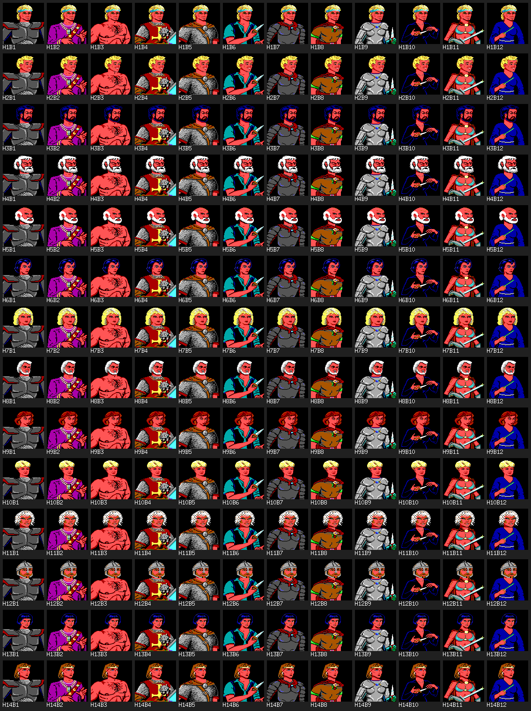
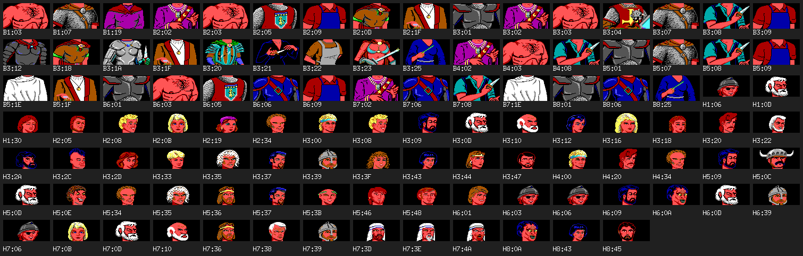

# 人物肖像圖鑑

DOS 版《Pool of Radiance》把人物肖像拆成 HEAD（頭，88×40）與 BODY（身體，88×48）
兩種容器，各 8 個 archive——`HEAD1.DAX`…`HEAD8.DAX`、`BODY1.DAX`…`BODY8.DAX`，
合計 109 張原始圖。遊戲把一張 HEAD 疊在一張 BODY 上面，拼成 88×88 的半身像
（見 [spec 006](../spec/006-dos-portrait-archives.md)）。

109 張裡，26 張（14 個 HEAD、12 個 BODY，都在 archive 3）是建角畫面裡玩家自己
挑頭與身體的選項，不對應特定角色。目前查得出名字、能對回劇情的只有一位——
市議會派來的城市導覽員 **Rolf**，他的頭像剛好也是建角選項之一，身體則是專屬、
不開放玩家選的一張。其餘 82 張查不到對應的劇情人物：不是漏查，是原版除了
Rolf 那一組之外，沒有第二條「肖像選擇子 → 特定 NPC」的證據鏈（原因見下）。

| 分類 | 張數 | 說明 |
|---|---:|---|
| 建角可選（HEAD） | 14 | archive 3，選 1..14 |
| 建角可選（BODY） | 12 | archive 3，選 1..12 |
| 已確認身分的 NPC | 1（Rolf，用 2 張：HEAD3 0x08 ＋ BODY3 0x09）| HEAD3 0x08 同時也是建角選項 2 |
| 未查 | 82 | 無法對回特定角色 |
| **合計** | **109** | |

## 資料來源與怎麼重生

- DOS ZIP：`Pool of Radiance (1988).zip`，SHA-256
  `1a7386c3842d3c6b0d02d9e607af249b2b452adb396a17f0971d09b2346b1633`
  （與 [spec 006](../spec/006-dos-portrait-archives.md)、
  `docs/audit/dos-portrait-shapes.json` 一致）。
- 匯出工具：[`cmd/pool-portrait-atlas`](../../cmd/pool-portrait-atlas)，收據在
  [`docs/audit/portrait-atlas.json`](../audit/portrait-atlas.json)。全部 PNG 由程式
  直接從 DAX 解出來，沒有手工貼圖。
- 重生指令：

  ```
  tools/go.sh run ./cmd/pool-portrait-atlas
  ```

  會覆寫 `docs/archaeology/img/portraits/` 底下全部 PNG 與收據 JSON。

- 推論等級沿用專案慣例：`exact`（逐位元組／逐像素核對過）、`strong inference`
  （多條間接證據互相印證，但沒有逐像素核對）、`hypothesis`（有線索但未驗證）、
  以及本文額外用的「未查」（連線索都沒有，不強行猜）。

## 建角可以選的 26 張

[spec 006](../spec/006-dos-portrait-archives.md) 已經驗證：建角畫面只用
`HEAD3.DAX` 與 `BODY3.DAX`，各自的 21／16 張原始圖裡只有 14／12 張開放玩家選
（其餘的在原版選單裡按不到，見下方完整清單裡「未查」那幾列）。這支工具會直接呼叫
production code（`internal/assets/portrait.go` 的 `ReadCreationPortraitParts`／
`ComposeCreationPortrait`），再拿合成結果去比對原始 109 張裡哪一張逐位元組相同，
藉此把「selector 幾號」換算回「block 幾號」——不是抄一份數字表，是每次重生都重新
核對一次。

14×12 全部組合的接觸表：



| HEAD selector | block | | BODY selector | block |
|---:|---|---|---:|---|
| 1 | 0x00 | | 1 | 0x01 |
| 2 | 0x08（＝ Rolf 的頭）| | 2 | 0x02 |
| 3 | 0x09 | | 3 | 0x03 |
| 4 | 0x0D | | 4 | 0x04 |
| 5 | 0x10 | | 5 | 0x07 |
| 6 | 0x12 | | 6 | 0x08 |
| 7 | 0x16 | | 7 | 0x12 |
| 8 | 0x22 | | 8 | 0x18 |
| 9 | 0x2D | | 9 | 0x1A |
| 10 | 0x33 | | 10 | 0x21 |
| 11 | 0x35 | | 11 | 0x23 |
| 12 | 0x39 | | 12 | 0x25 |
| 13 | 0x43 | | | |
| 14 | 0x44 | | | |

證據等級：`exact`（合成結果與原始 block 逐像素相同，工具跑一次驗一次）。

## 確認身分的 NPC：Rolf

Rolf 是遊戲開場市議會派來的城市導覽員，走出市政廳、踏上新菲蘭城的碼頭區
（archive 3、GEO3/0）那一步就會遇到。ECL3/block 0 在 `B0AAh` 執行
`SETUP MONSTER 12, 2, 9`，接著兩次 `APPROACH`（`B0B2h`／`B0B4h`），螢幕上第一
人稱視窗會被他的半身像整個蓋住；緊接著印出的原文是：

> 'GREETINGS, COURAGEOUS ONES, I AM ROLF, APPOINTED BY THE COUNCIL TO INTRODUCE
> NEWCOMERS TO THE FAIR CITY OF PHLAN. IF YOU WILL ACCOMPANY ME, I WILL START
> THE TOUR.'
>
> —— `ecl3.dax` block 0，位址 `0xB0B6`（`docs/audit/dos-ecl-text-inventory.json`）

身分怎麼定下來的（[spec 117](../spec/117-npc-approach-portrait.md)）：

1. `SETUP MONSTER` 的第三個 operand（9）就是 BODY 區塊編號——ECL 直接告訴你
   身體用哪一張。
2. HEAD 用哪一張則不在 ECL 裡：原版是從角色結構的 `+5C2h` 讀，而這個欄位的
   寫入點在 38 顆 overlay 與 `START.EXE` 裡逐位元組掃過，只找到一處寫 `0xFF`
   （初始化用的哨兵值），真正的 producer 還沒找到。
3. 所以 HEAD 是**從原版畫面量出來的**：`docs/reference/original-dos/adventure/
   03-rolf-approach.png` 裁下第一人稱框那一塊 88×88，上半 88×40 與 `HEAD3.DAX`
   區塊 `0x08` 逐格 100% 相同，下半 88×48 與 `BODY3.DAX` 區塊 `0x09`（正好等於
   ECL 的第三個 operand）逐格 100% 相同。
4. 負對照：把同一塊截圖拿去跟 `PIC3.DAX` 的 8 張候選圖比對，最高不到 60%，
   排除「圖其實來自 PIC 容器」這個可能。

合成出來的半身像：


證據等級：`exact`。這條也回過來驗證了一個有意思的細節——BODY3 的區塊 `0x09`
**不在**建角可選的 12 張裡（玩家選單按不到），所以 Rolf 的身體是保留給 NPC 專用、
不開放玩家撞名的一張；他的頭則剛好與建角選項 2 共用同一張圖。

## 剩下 82 張為什麼查不到

[spec 117](../spec/117-npc-approach-portrait.md) 講得很清楚：能把「肖像
selector」接回「特定 NPC」的鏈路只有 Rolf 這一組，而且是靠原版截圖逐像素比對
才確認的，不是靠讀懂了 `+5C2h` 的寫入邏輯。找到 producer 之前，其他 NPC 的
HEAD／BODY 只能用同一招——原版截圖裡剛好露出那張半身像才驗證得到。目前
`docs/reference/original-dos/` 底下只有 Rolf 那一張截圖露出了半身像框；其餘
畫面拍到的都是第一人稱視野（沒有 NPC 蓋框）或選單畫面，沒有第二筆可以拿來比對。

換句話說，這 82 張不是「還沒空查」，是**現階段沒有能驗證的原版畫面可以核對**。
硬猜哪張圖配哪個 NPC只會產生自洽但錯的結論，所以一律標「未查」。

## 劇情裡的位置：archive 編號對到哪裡

`HEAD<N>.DAX`／`BODY<N>.DAX` 的 `N` 跟 `ECL<N>.DAX`／`GEO<N>.DAX` 是同一個
archive 編號。下表整理每個 archive 底下已經有 spec 佐證的地點——**這只是劇情
背景，不是肖像身分的證據**：知道 archive 3 對應新菲蘭城，不代表 archive 3 裡
沒被指認的那幾張頭像就是城裡哪個路人；除了 Rolf 那一組，目前沒有任何一張肖像
與「這個 archive 演哪裡」之間有直接的證據鏈。放這張表純粹是方便查表時知道自己
在看哪一區。

| archive | 劇情裡的位置 | 證據等級 | 出處 |
|---:|---|---|---|
| 1 | 波多廣場 Podol Plaza（ECL1/18）| exact | spec 055 |
| 2 | 貧民區 Phlan Slums（ECL2/20）| exact | spec 042 |
| 2 | 斯托亞諾夫城門 Stojanow Gate（ECL2/9）| exact | spec 101 |
| 2 | 曼多爾圖書館 Mendor's Library（ECL2/15）| exact | spec 055 |
| 3 | 新菲蘭城／碼頭 New Phlan／Harbor（ECL3/0，Rolf 接待場景）| exact | spec 055、117 |
| 3 | 市政廳 City Hall（ECL3/8）| exact | spec 023 |
| 3 | 競技場 Arena（ECL3/11）| exact | spec 102 |
| 4 | 索卡爾城堡 Sokal Keep（ECL4/21）| exact | spec 055 |
| 4 | 卡德納紡織廠 Cadorna Textile House（ECL4/2）| exact | spec 055 |
| 4 | 瓦海登墳場 Valhingen Graveyard（ECL4/10）| exact | spec 055 |
| 5 | 瓦傑沃城堡 Valjevo Castle，庭院與樓層（ECL5/3、4、5、6、7）| exact | spec 101；本文核對 `dos-ecl-text-inventory.json` 的 `ecl5.dax block 6`：「THE WOMAN SAYS 'TYRANTHRAXUS IS LEADING OUR MEN TO THEIR DEATHS…'」|
| 6 | 西野外 western wilderness sheet（ECL6/25）| exact | spec 105 |
| 6 | 海盜基地 Buccaneer Base（ECL6/1）| exact | spec 105 |
| 6 | 龍穴（ECL6/19）| exact | spec 105 |
| 6 | 前哨站 Outpost（ECL6/28）| exact | spec 101、105 |
| 7 | 中段野外 middle wilderness sheet（ECL7/26）| exact | spec 105 |
| 7 | ECL7/17、ECL7/22——靜態展開失敗（opcode 未知），未查 | — | spec 055 |
| 7 | ECL7/23——未定位 | — | spec 055 |
| 8 | 古托井 Kuto's Well（ECL8/29）| exact | spec 055 |
| 8 | 東野外 eastern wilderness sheet（ECL8/27）| exact | spec 105 |
| 8 | 廢墟城堡 Ruined Castle（ECL8/16）| exact | spec 101、105 |
| 8 | 洞窟（ECL8/13）| strong inference | spec 105（只有地點腳本的第一句當線索，沒有逐位元組核對）|

archive 1 的 `ECL1/24`、archive 3 的 `ECL3/14` 兩個自載區塊目前沒有對應地名
（spec 055 列為未定位）。

## 完整清單：109 張逐一對照

109 張全部縮圖排在一張接觸表裡，標籤是「H／B ＋ archive 編號 ＋ block 十六進位」：



下面逐 archive 列出每一列都是一張原始 PNG，連到 `img/portraits/` 底下的實際
檔案；身分欄查不到就寫「未查」，不留白也不用猜的。

### Archive 1

劇情裡的位置：波多廣場 Podol Plaza（ECL1/18，exact，spec 055）

| 檔案 | block | PNG | 身分 | 備註 |
|---|---|---|---|---|
| HEAD1.DAX | 0x06 | [head1-06.png](img/portraits/head1-06.png) | 未查 |  |
| HEAD1.DAX | 0x0D | [head1-0d.png](img/portraits/head1-0d.png) | 未查 |  |
| HEAD1.DAX | 0x30 | [head1-30.png](img/portraits/head1-30.png) | 未查 |  |
| BODY1.DAX | 0x03 | [body1-03.png](img/portraits/body1-03.png) | 未查 |  |
| BODY1.DAX | 0x07 | [body1-07.png](img/portraits/body1-07.png) | 未查 |  |
| BODY1.DAX | 0x19 | [body1-19.png](img/portraits/body1-19.png) | 未查 |  |

### Archive 2

劇情裡的位置：貧民區 Phlan Slums（ECL2/20，exact，spec 042）／斯托亞諾夫城門 Stojanow Gate（ECL2/9，exact，spec 101）／曼多爾圖書館 Mendor's Library（ECL2/15，exact，spec 055）

| 檔案 | block | PNG | 身分 | 備註 |
|---|---|---|---|---|
| HEAD2.DAX | 0x05 | [head2-05.png](img/portraits/head2-05.png) | 未查 |  |
| HEAD2.DAX | 0x08 | [head2-08.png](img/portraits/head2-08.png) | 未查 |  |
| HEAD2.DAX | 0x0B | [head2-0b.png](img/portraits/head2-0b.png) | 未查 |  |
| HEAD2.DAX | 0x19 | [head2-19.png](img/portraits/head2-19.png) | 未查 |  |
| HEAD2.DAX | 0x34 | [head2-34.png](img/portraits/head2-34.png) | 未查 |  |
| BODY2.DAX | 0x02 | [body2-02.png](img/portraits/body2-02.png) | 未查 |  |
| BODY2.DAX | 0x03 | [body2-03.png](img/portraits/body2-03.png) | 未查 |  |
| BODY2.DAX | 0x05 | [body2-05.png](img/portraits/body2-05.png) | 未查 |  |
| BODY2.DAX | 0x09 | [body2-09.png](img/portraits/body2-09.png) | 未查 |  |
| BODY2.DAX | 0x0D | [body2-0d.png](img/portraits/body2-0d.png) | 未查 |  |
| BODY2.DAX | 0x1F | [body2-1f.png](img/portraits/body2-1f.png) | 未查 |  |

### Archive 3

劇情裡的位置：新菲蘭城／碼頭 New Phlan／Harbor（ECL3/0，Rolf 接待場景，exact，spec 055、117）／市政廳 City Hall（ECL3/8，exact，spec 023）／競技場 Arena（ECL3/11，exact，spec 102）

| 檔案 | block | PNG | 身分 | 備註 |
|---|---|---|---|---|
| HEAD3.DAX | 0x00 | [head3-00.png](img/portraits/head3-00.png) | 玩家可選（建角） | 建角 HEAD selector 1 |
| HEAD3.DAX | 0x08 | [head3-08.png](img/portraits/head3-08.png) | Rolf／玩家可選（建角） | spec 117；同時是建角 HEAD selector 2 |
| HEAD3.DAX | 0x09 | [head3-09.png](img/portraits/head3-09.png) | 玩家可選（建角） | 建角 HEAD selector 3 |
| HEAD3.DAX | 0x0D | [head3-0d.png](img/portraits/head3-0d.png) | 玩家可選（建角） | 建角 HEAD selector 4 |
| HEAD3.DAX | 0x10 | [head3-10.png](img/portraits/head3-10.png) | 玩家可選（建角） | 建角 HEAD selector 5 |
| HEAD3.DAX | 0x12 | [head3-12.png](img/portraits/head3-12.png) | 玩家可選（建角） | 建角 HEAD selector 6 |
| HEAD3.DAX | 0x16 | [head3-16.png](img/portraits/head3-16.png) | 玩家可選（建角） | 建角 HEAD selector 7 |
| HEAD3.DAX | 0x18 | [head3-18.png](img/portraits/head3-18.png) | 未查 |  |
| HEAD3.DAX | 0x20 | [head3-20.png](img/portraits/head3-20.png) | 未查 |  |
| HEAD3.DAX | 0x22 | [head3-22.png](img/portraits/head3-22.png) | 玩家可選（建角） | 建角 HEAD selector 8 |
| HEAD3.DAX | 0x2A | [head3-2a.png](img/portraits/head3-2a.png) | 未查 |  |
| HEAD3.DAX | 0x2C | [head3-2c.png](img/portraits/head3-2c.png) | 未查 |  |
| HEAD3.DAX | 0x2D | [head3-2d.png](img/portraits/head3-2d.png) | 玩家可選（建角） | 建角 HEAD selector 9 |
| HEAD3.DAX | 0x33 | [head3-33.png](img/portraits/head3-33.png) | 玩家可選（建角） | 建角 HEAD selector 10 |
| HEAD3.DAX | 0x35 | [head3-35.png](img/portraits/head3-35.png) | 玩家可選（建角） | 建角 HEAD selector 11 |
| HEAD3.DAX | 0x37 | [head3-37.png](img/portraits/head3-37.png) | 未查 |  |
| HEAD3.DAX | 0x39 | [head3-39.png](img/portraits/head3-39.png) | 玩家可選（建角） | 建角 HEAD selector 12 |
| HEAD3.DAX | 0x3F | [head3-3f.png](img/portraits/head3-3f.png) | 未查 |  |
| HEAD3.DAX | 0x43 | [head3-43.png](img/portraits/head3-43.png) | 玩家可選（建角） | 建角 HEAD selector 13 |
| HEAD3.DAX | 0x44 | [head3-44.png](img/portraits/head3-44.png) | 玩家可選（建角） | 建角 HEAD selector 14 |
| HEAD3.DAX | 0x47 | [head3-47.png](img/portraits/head3-47.png) | 未查 |  |
| BODY3.DAX | 0x01 | [body3-01.png](img/portraits/body3-01.png) | 玩家可選（建角） | 建角 BODY selector 1 |
| BODY3.DAX | 0x02 | [body3-02.png](img/portraits/body3-02.png) | 玩家可選（建角） | 建角 BODY selector 2 |
| BODY3.DAX | 0x03 | [body3-03.png](img/portraits/body3-03.png) | 玩家可選（建角） | 建角 BODY selector 3 |
| BODY3.DAX | 0x04 | [body3-04.png](img/portraits/body3-04.png) | 玩家可選（建角） | 建角 BODY selector 4 |
| BODY3.DAX | 0x07 | [body3-07.png](img/portraits/body3-07.png) | 玩家可選（建角） | 建角 BODY selector 5 |
| BODY3.DAX | 0x08 | [body3-08.png](img/portraits/body3-08.png) | 玩家可選（建角） | 建角 BODY selector 6 |
| BODY3.DAX | 0x09 | [body3-09.png](img/portraits/body3-09.png) | Rolf（見下） | spec 117；不在建角可選清單 |
| BODY3.DAX | 0x12 | [body3-12.png](img/portraits/body3-12.png) | 玩家可選（建角） | 建角 BODY selector 7 |
| BODY3.DAX | 0x18 | [body3-18.png](img/portraits/body3-18.png) | 玩家可選（建角） | 建角 BODY selector 8 |
| BODY3.DAX | 0x1A | [body3-1a.png](img/portraits/body3-1a.png) | 玩家可選（建角） | 建角 BODY selector 9 |
| BODY3.DAX | 0x1F | [body3-1f.png](img/portraits/body3-1f.png) | 未查 |  |
| BODY3.DAX | 0x20 | [body3-20.png](img/portraits/body3-20.png) | 未查 |  |
| BODY3.DAX | 0x21 | [body3-21.png](img/portraits/body3-21.png) | 玩家可選（建角） | 建角 BODY selector 10 |
| BODY3.DAX | 0x22 | [body3-22.png](img/portraits/body3-22.png) | 未查 |  |
| BODY3.DAX | 0x23 | [body3-23.png](img/portraits/body3-23.png) | 玩家可選（建角） | 建角 BODY selector 11 |
| BODY3.DAX | 0x25 | [body3-25.png](img/portraits/body3-25.png) | 玩家可選（建角） | 建角 BODY selector 12 |

### Archive 4

劇情裡的位置：索卡爾城堡 Sokal Keep（ECL4/21，exact，spec 055）／卡德納紡織廠 Cadorna Textile House（ECL4/2，exact，spec 055）／瓦海登墳場 Valhingen Graveyard（ECL4/10，exact，spec 055）

| 檔案 | block | PNG | 身分 | 備註 |
|---|---|---|---|---|
| HEAD4.DAX | 0x00 | [head4-00.png](img/portraits/head4-00.png) | 未查 |  |
| HEAD4.DAX | 0x20 | [head4-20.png](img/portraits/head4-20.png) | 未查 |  |
| HEAD4.DAX | 0x34 | [head4-34.png](img/portraits/head4-34.png) | 未查 |  |
| BODY4.DAX | 0x02 | [body4-02.png](img/portraits/body4-02.png) | 未查 |  |
| BODY4.DAX | 0x03 | [body4-03.png](img/portraits/body4-03.png) | 未查 |  |
| BODY4.DAX | 0x08 | [body4-08.png](img/portraits/body4-08.png) | 未查 |  |

### Archive 5

劇情裡的位置：瓦傑沃城堡 Valjevo Castle（ECL5/3、4、5、6、7，exact，spec 101；引文見下）

| 檔案 | block | PNG | 身分 | 備註 |
|---|---|---|---|---|
| HEAD5.DAX | 0x09 | [head5-09.png](img/portraits/head5-09.png) | 未查 |  |
| HEAD5.DAX | 0x0C | [head5-0c.png](img/portraits/head5-0c.png) | 未查 |  |
| HEAD5.DAX | 0x0D | [head5-0d.png](img/portraits/head5-0d.png) | 未查 |  |
| HEAD5.DAX | 0x0E | [head5-0e.png](img/portraits/head5-0e.png) | 未查 |  |
| HEAD5.DAX | 0x34 | [head5-34.png](img/portraits/head5-34.png) | 未查 |  |
| HEAD5.DAX | 0x35 | [head5-35.png](img/portraits/head5-35.png) | 未查 |  |
| HEAD5.DAX | 0x36 | [head5-36.png](img/portraits/head5-36.png) | 未查 |  |
| HEAD5.DAX | 0x37 | [head5-37.png](img/portraits/head5-37.png) | 未查 |  |
| HEAD5.DAX | 0x3B | [head5-3b.png](img/portraits/head5-3b.png) | 未查 |  |
| HEAD5.DAX | 0x46 | [head5-46.png](img/portraits/head5-46.png) | 未查 |  |
| HEAD5.DAX | 0x48 | [head5-48.png](img/portraits/head5-48.png) | 未查 |  |
| BODY5.DAX | 0x01 | [body5-01.png](img/portraits/body5-01.png) | 未查 |  |
| BODY5.DAX | 0x07 | [body5-07.png](img/portraits/body5-07.png) | 未查 |  |
| BODY5.DAX | 0x08 | [body5-08.png](img/portraits/body5-08.png) | 未查 |  |
| BODY5.DAX | 0x09 | [body5-09.png](img/portraits/body5-09.png) | 未查 |  |
| BODY5.DAX | 0x1E | [body5-1e.png](img/portraits/body5-1e.png) | 未查 |  |
| BODY5.DAX | 0x1F | [body5-1f.png](img/portraits/body5-1f.png) | 未查 |  |

### Archive 6

劇情裡的位置：西野外 western wilderness sheet（ECL6/25，exact，spec 105）／海盜基地 Buccaneer Base（ECL6/1，exact，spec 105）／龍穴 dragon cave（ECL6/19，exact，spec 105）／前哨站 Outpost（ECL6/28，exact，spec 101、105）

| 檔案 | block | PNG | 身分 | 備註 |
|---|---|---|---|---|
| HEAD6.DAX | 0x01 | [head6-01.png](img/portraits/head6-01.png) | 未查 |  |
| HEAD6.DAX | 0x03 | [head6-03.png](img/portraits/head6-03.png) | 未查 |  |
| HEAD6.DAX | 0x06 | [head6-06.png](img/portraits/head6-06.png) | 未查 |  |
| HEAD6.DAX | 0x09 | [head6-09.png](img/portraits/head6-09.png) | 未查 |  |
| HEAD6.DAX | 0x0A | [head6-0a.png](img/portraits/head6-0a.png) | 未查 |  |
| HEAD6.DAX | 0x0D | [head6-0d.png](img/portraits/head6-0d.png) | 未查 |  |
| HEAD6.DAX | 0x39 | [head6-39.png](img/portraits/head6-39.png) | 未查 |  |
| BODY6.DAX | 0x01 | [body6-01.png](img/portraits/body6-01.png) | 未查 |  |
| BODY6.DAX | 0x03 | [body6-03.png](img/portraits/body6-03.png) | 未查 |  |
| BODY6.DAX | 0x05 | [body6-05.png](img/portraits/body6-05.png) | 未查 |  |
| BODY6.DAX | 0x06 | [body6-06.png](img/portraits/body6-06.png) | 未查 |  |
| BODY6.DAX | 0x09 | [body6-09.png](img/portraits/body6-09.png) | 未查 |  |

### Archive 7

劇情裡的位置：中段野外 middle wilderness sheet（ECL7/26，exact，spec 105）／ECL7/17、ECL7/22 靜態展開失敗、opcode 未知（spec 055）／ECL7/23 未定位（spec 055）

| 檔案 | block | PNG | 身分 | 備註 |
|---|---|---|---|---|
| HEAD7.DAX | 0x06 | [head7-06.png](img/portraits/head7-06.png) | 未查 |  |
| HEAD7.DAX | 0x0B | [head7-0b.png](img/portraits/head7-0b.png) | 未查 |  |
| HEAD7.DAX | 0x0D | [head7-0d.png](img/portraits/head7-0d.png) | 未查 |  |
| HEAD7.DAX | 0x10 | [head7-10.png](img/portraits/head7-10.png) | 未查 |  |
| HEAD7.DAX | 0x36 | [head7-36.png](img/portraits/head7-36.png) | 未查 |  |
| HEAD7.DAX | 0x38 | [head7-38.png](img/portraits/head7-38.png) | 未查 |  |
| HEAD7.DAX | 0x39 | [head7-39.png](img/portraits/head7-39.png) | 未查 |  |
| HEAD7.DAX | 0x3D | [head7-3d.png](img/portraits/head7-3d.png) | 未查 |  |
| HEAD7.DAX | 0x3E | [head7-3e.png](img/portraits/head7-3e.png) | 未查 |  |
| HEAD7.DAX | 0x4A | [head7-4a.png](img/portraits/head7-4a.png) | 未查 |  |
| BODY7.DAX | 0x02 | [body7-02.png](img/portraits/body7-02.png) | 未查 |  |
| BODY7.DAX | 0x06 | [body7-06.png](img/portraits/body7-06.png) | 未查 |  |
| BODY7.DAX | 0x08 | [body7-08.png](img/portraits/body7-08.png) | 未查 |  |
| BODY7.DAX | 0x1E | [body7-1e.png](img/portraits/body7-1e.png) | 未查 |  |

### Archive 8

劇情裡的位置：古托井 Kuto's Well（ECL8/29，exact，spec 055）／東野外 eastern wilderness sheet（ECL8/27，exact，spec 105）／廢墟城堡 Ruined Castle（ECL8/16，exact，spec 101、105）／洞窟（ECL8/13，strong inference，spec 105）

| 檔案 | block | PNG | 身分 | 備註 |
|---|---|---|---|---|
| HEAD8.DAX | 0x0A | [head8-0a.png](img/portraits/head8-0a.png) | 未查 |  |
| HEAD8.DAX | 0x43 | [head8-43.png](img/portraits/head8-43.png) | 未查 |  |
| HEAD8.DAX | 0x45 | [head8-45.png](img/portraits/head8-45.png) | 未查 |  |
| BODY8.DAX | 0x01 | [body8-01.png](img/portraits/body8-01.png) | 未查 |  |
| BODY8.DAX | 0x06 | [body8-06.png](img/portraits/body8-06.png) | 未查 |  |
| BODY8.DAX | 0x25 | [body8-25.png](img/portraits/body8-25.png) | 未查 |  |

## 收據裡有什麼

[`docs/audit/portrait-atlas.json`](../audit/portrait-atlas.json) 記了輸入 ZIP
的檔名與 SHA-256、16 個 archive 逐一解出來的 109 個 block（來源檔名、block ID、
尺寸、輸出 PNG 路徑與 PNG 自己的 SHA-256）、建角 14×12 表的 selector→block
對照、以及 Rolf 那組的 HEAD／BODY block 編號與證據出處。收據是工具自己寫的，
不是手打——改了 DOS ZIP 或 engine 的解碼邏輯，重跑一次就會反映在新的雜湊上。
